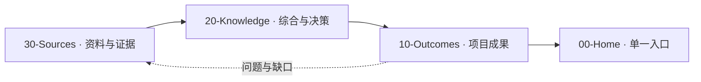

# AlphaEngine

> [!abstract] 项目目标
> 实现一个现代高性能实时渲染器。MVP 1 已完成 D3D12 纵向切片；当前在其可运行、可验证、可测量的基础上进入 MVP 2，最终实现 Vulkan 功能对等。

> [!tip] LLM Wiki × Obsidian
> LLM Wiki 负责持续采集、综合、交叉引用和维护；Obsidian 负责 Properties、WikiLinks、Backlinks、MOC 和 Graph。它们不是两个文档系统，而是同一套知识生产与浏览方式。

## 知识生产链

| 层 | 回答的问题 | 入口 |
|---|---|---|
| Outcomes（成果） | 现在要实现什么？ | [[10-Outcomes/10-AlphaEngine|项目系统与路线]]、[[10-Outcomes/20-MVP1|MVP 1 技术设计]]、[[10-Outcomes/30-MVP2|MVP 2 能力矩阵]] |
| Knowledge（知识） | 为什么这样设计？ | [[20-Knowledge/00-Knowledge-MOC|知识 MOC]] |
| Sources（资料源） | 依据来自哪里？ | [[30-Sources/00-Sources-MOC|资料源 MOC]] |
| System（系统） | 如何维护这套 Wiki？ | [[90-System/LLM-Wiki-Obsidian|LLM Wiki × Obsidian 工作模式]] |

## 当前焦点

[[10-Outcomes/20-MVP1]] 已作为接受的实现合同完成：模块、技术、固定 ABI、依赖、参考内容、图像回归和真机性能证据均已闭合。下一项工作是按 [[10-Outcomes/30-MVP2]] 的 MVP 2.1 GPU Foundation 推进 Full Bindless、GPU Scene、Transient/Aliasing、Multi-Queue、PSO Cache 与显存基线。

## 导航

- **我要了解整个项目** → [[10-Outcomes/10-AlphaEngine]]
- **我要实现或评审 MVP 1** → [[10-Outcomes/20-MVP1]]
- **我要查看后续现代渲染能力** → [[10-Outcomes/30-MVP2]]
- **我要查询术语或设计理由** → [[20-Knowledge/00-Knowledge-MOC]]
- **我要追溯外部依据** → [[30-Sources/00-Sources-MOC]]
- **我要维护文档系统** → [[90-System/LLM-Wiki-Obsidian]]

## 知识库规则

1. 一个实施结论只有一个 owner note：项目边界归 [[10-Outcomes/10-AlphaEngine]]，MVP 1 合同归 [[10-Outcomes/20-MVP1]]，MVP 2 能力归 [[10-Outcomes/30-MVP2]]。
2. Knowledge 保存综合、决策和概念，Sources 保存可追溯依据；两者不得平行复制成果合同。
3. 新资料按 Sources → Knowledge → Outcomes 的顺序产生影响，查询则从 Home → Outcomes 逆向追溯。
4. 每份活跃笔记必须有 YAML Properties，并能从本页沿 Wiki Link 到达。完整规则见 [[90-System/Schema]]。
