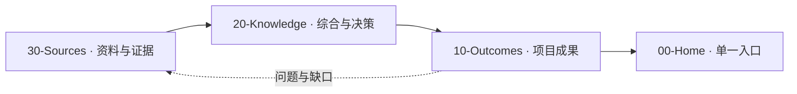

# AlphaEngine

> [!abstract] 项目目标
> 实现一个现代高性能实时渲染器。当前 `fromzero` 分支为**空基线重启**：本文档确立了 LLM Wiki × Obsidian 知识库框架；引擎目标、技术栈与版本边界仍待成果层确认，仓库中已有一个可运行的学习性过渡实现（见 [[10-Outcomes/10-AlphaEngine#实现现状（学习性过渡基线）|实现现状]]）。

> [!tip] LLM Wiki × Obsidian
> LLM Wiki 负责持续采集、综合、交叉引用和维护；Obsidian 负责 Properties、WikiLinks、Backlinks、MOC 和 Graph。它们不是两个文档系统，而是同一套知识生产与浏览方式。

## 知识生产链

| 层 | 回答的问题 | 入口 |
|---|---|---|
| Outcomes（成果） | 现在要实现什么？ | [[10-Outcomes/10-AlphaEngine|项目系统与路线]] |
| Knowledge（知识） | 为什么这样设计？ | [[20-Knowledge/00-Knowledge-MOC|知识 MOC]] |
| Sources（资料源） | 依据来自哪里？ | [[30-Sources/00-Sources-MOC|资料源 MOC]] |
| System（系统） | 如何维护这套 Wiki？ | [[90-System/LLM-Wiki-Obsidian|LLM Wiki × Obsidian 工作模式]] |

## 当前焦点

框架已经建立并转入持续维护：Sources → Knowledge → Outcomes 三层均有承载页，仓库中存在一个可运行的学习性过渡实现（CPU 侧光追，见 [[10-Outcomes/10-AlphaEngine]]）。**下一动作仍是固化首版基线**——渲染技术栈（图形 API / 语言标准 / 构建与依赖管理）、首个可验证里程碑及其验收合同。四项基线决策落位后，在 [[10-Outcomes/10-AlphaEngine|项目系统与路线]] 建立版本 owner note，并把「实现现状」一节移交该 owner；在此之前，过渡实现不得被当作架构决策引用。

## 导航

- **我要了解整个项目** → [[10-Outcomes/10-AlphaEngine]]
- **我要查询术语或设计理由** → [[20-Knowledge/00-Knowledge-MOC]]
- **我要追溯外部依据** → [[30-Sources/00-Sources-MOC]]
- **我要维护文档系统** → [[90-System/LLM-Wiki-Obsidian]]

## 知识库规则

1. 一个实施结论只有一个 owner note：项目边界归 [[10-Outcomes/10-AlphaEngine]]，后续每个版本成果各自独立 owner。
2. Knowledge 保存综合、决策和概念，Sources 保存可追溯依据；两者不得平行复制成果合同。
3. 新资料按 Sources → Knowledge → Outcomes 的顺序产生影响，查询则从 Home → Outcomes 逆向追溯。
4. 每份活跃笔记必须有 YAML Properties，并能从本页沿 Wiki Link 到达。完整规则见 [[90-System/Schema]]。
