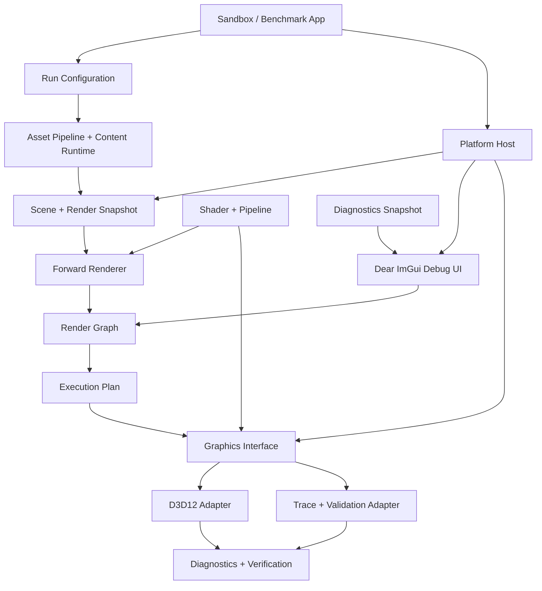

# AlphaEngine MVP 1 技术设计

## 1. 阅读方式与文档权威

本文是 **MVP 1 唯一实施主文档**：交付范围、Module、Interface、技术、数据流、生命周期、错误、性能和完成定义都在这里维护。实现或评审 MVP 1 不需要顺序阅读 LLM Wiki。

按角色阅读：

- 了解 MVP 1：读第 3–5 节和第 12 节。
- 实现某个 Module：读第 5 节对应小节，再读第 6–8 节共同合同。
- 评审范围与交付：读第 3、8、10–12 节。
- 查询选择理由或外部依据：才进入文末的 Agent reference。

Wiki Contract、ADR 和来源卡片只保存理由、研究与历史，不新增实现义务。发现冲突时先修订或评审本文，不把冲突留给实现者自行判断。

状态说明：

- **已确认**：已有正式决策，可以直接约束实现。
- **已接受**：MVP 1 实现和验收证据已经满足本文合同；后续改动必须显式升级 schema、ABI 或版本成果。

> [!success] MVP 1 已完成（2026-08-20）
> D3D12 纵向切片、Dear ImGui 调试界面、离线内容/Shader 管线、Trace/Validation、图像回归与 1080p 真机性能门禁均已通过。唯一正式证据目录为 `runs/20260820T062543Z-840c35256c26`；本页以下内容同时是实现说明和冻结合同。

| 验收项 | 已接受结果 |
|---|---|
| 参考内容 | package schema v2；100 个 glTF node、200 个可见 OPAQUE/MASK Render Object、5 类 PBR Texture |
| Shader/Binding | DXC `1.9.2607.13`、SM 6.0、Shader Package 与 Binding ABI v2、`row_major float4x4` |
| D3D12 | Agility SDK `1.619.5`；FL 12_0、RS 1.1、Binding Tier 3；单 Direct Queue、2 帧在飞、3 缓冲 |
| 自动验证 | 38/38 unit/contract tests；10,000 帧 Trace 生命周期；100 次 D3D12 resize；WARP 与 UI smoke 通过 |
| 真机性能 | GTX 1080 Ti，1920×1080；CPU frame p99 `5.3959 ms`，submission p99 `3.8024 ms`，GPU frame p99 `4.950016 ms` |
| 图像/诊断 | 1200 帧采样无 >22 ms hitch；full-frame linearized SDR golden 通过；validation errors 为 0 |

## 2. 项目总目标

AlphaEngine 的项目总目标是实现一个**现代高性能实时渲染器（modern high-performance real-time renderer）**，而不是通用游戏引擎。

“现代”在本项目中至少意味着：

- 以 D3D12 和 Vulkan 这类显式图形后端为基础，Renderer 不依赖某个后端的原生类型。
- 使用 Render Snapshot、Render Graph、Execution Plan 和明确的 GPU Resource Usage 组织一帧。
- 资源、同步、绑定、Shader ABI、诊断和性能数据都是显式、可验证、可回归的合同。
- 架构能够逐步承载 Bindless、GPU Scene、GPU-driven、Meshlet/Mesh Shader、时域渲染、虚拟化资源和多 Queue，而不要求重写 Scene 与 Renderer。

“高性能”不只表示平均 FPS 高，而是：

- CPU、Render Submission 和 GPU 帧时间均可测量，使用 p99 和 hitch 约束稳定性。
- 帧热路径不逐 Draw 分配堆内存，不获取全局锁，不依赖异常或 RTTI 调度。
- 数据按帧冻结、连续存放并批量提交；资源生命周期由 Submission Token 精确约束。
- 性能回归与图像正确性回归同等重要，不能以关闭验证或降低正确性换取通过。

MVP 1 不是最终渲染能力集合。它用一个小而完整的 D3D12 纵向切片证明上述基础成立；现代高级能力在 MVP 2 扩展，Vulkan 在 MVP 3 验证后端对等性。

## 3. MVP 1 交付合同

MVP 1 在 Windows 10 22H2 x64 上，以 D3D12 渲染一个版本化参考场景，形成以下完整链路：

```text
GLB / Texture / HLSL
        ↓ offline cook / compile
Runtime Package + Shader Package
        ↓
Scene → immutable Render Snapshot
        ↓
Forward Renderer → Render Graph → Execution Plan
        ↓
Graphics Interface → D3D12 Adapter → Present
        ↓
Image / Validation / Performance Evidence
```

首个画面固定为：

- 静态 glTF Mesh，支持 `OPAQUE` 与 `MASK`；Scene Material 不支持透明混合，Dear ImGui Overlay 使用独立固定 alpha blend Pipeline。
- glTF metallic-roughness PBR Material，包含 Base Color、Metallic-Roughness、Normal、Occlusion 和 Emissive Texture。
- 一盏投射阴影的 Directional Light，最多四盏不投射阴影的 Point Light。
- 一张 2048×2048 Directional Shadow Map，单 cascade、固定 PCF。
- Forward Geometry 写入 `R16G16B16A16_FLOAT` HDR Scene Color，ACES fitted Tone Map 后输出 SDR。
- 1920×1080、关闭 VSync 的参考测试中，CPU frame p99 与 GPU frame p99 均不超过 16.67 ms。

## 4. 总体 Module 图



`Graphics Interface` 是 Renderer 与图形后端之间的真实 seam。D3D12、未来 Vulkan 和 Trace 是 Adapter；Renderer、Render Graph、Scene、Material 和 Asset 代码不得包含 D3D12/Vulkan 类型或原生 Handle。

### 4.1 项目级技术基线

| 领域 | MVP 1 技术基线 |
|---|---|
| 语言 | C++20；MSVC standards-conformance mode；Module Interface 不跨异常 |
| 编译器/SDK | MSVC 19.50+；Windows SDK `10.0.26100.0`；运行最低 Windows 10 22H2 |
| 构建 | CMake 3.31+、CMake Presets、Ninja Multi-Config；默认 `RelWithDebInfo` |
| 编译策略 | 第一方 `/W4 /permissive- /Zc:__cplusplus /utf-8 /EHsc /GR`；CI warning-as-error |
| 依赖 | vcpkg Manifest Mode + 固定 `builtin-baseline`；DirectX 官方 package 锁定确切版本 |
| Window/Input | SDL3；必要的 Win32 接入仅存在于 Platform Adapter |
| 图形 | DXGI + Direct3D 12 Agility SDK；FL 12_0、SM 6.0、Root Signature 1.1、Binding Tier 3 |
| Shader | HLSL + DXC `1.9.2607.13`；离线 DXIL + JSON metadata；Binding ABI v2 |
| 内容 | GLB/glTF 2.0 binary + PNG/JPEG，经 `assetc` Cook 为 runtime package |
| GPU 诊断 | D3D12 Debug Layer、GPU-Based Validation、DRED、PIX marker/timestamp |
| 调试界面 | Dear ImGui + SDL3 Platform Adapter + AlphaEngine Graphics Encoder；仅 Sandbox |
| 自动化 | 项目内轻量 `ALPHA_TEST` harness + CTest；Unit、Trace/Validation、D3D12 integration、image、performance 五层 |
| 运行产物 | JSON/JSON Lines 配置、能力、事件、图像与性能报告 |

精确依赖版本由 `vcpkg.json` 与 `cmake/DirectXPackages.cmake` 锁定，来源、许可证、安全边界和部署文件 hash 可追溯到 [[30-Sources/MVP1-Dependency-Baseline]]。

## 5. Module 清单与技术选型

| Module | Interface 产物 | MVP 1 implementation 与技术 | 状态 |
|---|---|---|---|
| Application | 生命周期、运行模式、退出状态 | `alpha_sandbox` 交互运行；`alpha_benchmark` 确定性回归；C++20 | 完成 |
| Run Configuration | 启动后冻结的 `RunConfig` | schema v1 JSON + command line；benchmark 强制确定性与 UI off | 完成 |
| Platform Host | Window Surface、输入事件、drawable extent、surface 状态 | SDL3 `3.4.12`；Win32 `HWND` 只在 Platform Adapter 内使用 | 完成 |
| Asset Pipeline | 版本化 runtime content package | fastgltf `0.9.0` + DirectXTex `2026-05-07`；有界 GLB/PNG/JPEG 预检；canonical Mesh/Texture/Material | 完成 |
| Content Runtime | Asset Handle、上传请求、资源就绪事件 | 后台 I/O 状态机；immutable payload；Submission Thread 发布与 token 延迟回收 | 完成 |
| Scene | 可变场景状态 | 稳定强类型 ID、node transform、Camera/Light/Renderable/bounds | 完成 |
| Render Snapshot | 每帧不可变、连续的渲染输入 | dense arrays；不持有 Scene 指针；固定数据合同 | 完成 |
| Renderer | 由 Snapshot 构建 Render Graph | 8-corner D3D frustum culling、确定性排序、Forward PBR、Shadow、Tone Map | 完成 |
| Render Graph | 一次性 `ExecutionPlan` | Pass DAG、logical resource、usage validation、确定性 topological plan | 完成 |
| Graphics Interface | Resource Handle、Frame Context、Submission Token、Encoder | Plan-driven interface；显式 `Result`；无后端类型 | 完成 |
| Shader + Pipeline | Shader Package、Binding Layout、Pipeline Handle | HLSL + DXC；离线 DXIL/metadata；SM 6.0；ABI/hash/entry/profile 运行时校验 | 完成 |
| D3D12 Adapter | 执行 Graphics Interface | Agility `1.619.5`、DXGI、D3D12、Direct Queue、Legacy Barrier | 完成 |
| Trace + Validation Adapter | 规范化执行 Trace、合同错误 | 无 GPU 行为测试；Handle、Usage、顺序、生命周期与上传/draw packet 检查 | 完成 |
| Diagnostics | Capability Report、event log、GPU marker、device-lost bundle | Debug Layer、InfoQueue、DRED1、PIX、两帧延迟 GPU timestamp、JSON Lines | 完成 |
| Debug UI | Input Capture、DebugSnapshot、Debug Overlay Pass | Dear ImGui `1.92.8#1`；SDL3 输入；后端无关 draw data；字体和内容 Texture preview | 完成 |
| Verification | Unit、integration、image、performance evidence | CTest、WARP/真实 GPU、full-frame golden、machine-readable reports | 完成 |

### 5.1 Application 与 Run Configuration

`sandbox` 用于窗口、相机和实时调试；`benchmark` 使用固定 manifest、固定相机路径和固定帧数，不接受交互输入改变结果。两者只负责组合 Module，不实现渲染规则。

`RunConfig` 的最小字段包括：内容 manifest、相机路径、Adapter LUID/auto/WARP、分辨率、VSync/tearing、frames in flight、Debug Layer、GPU Validation、DRED、Debug UI 开关、输出目录、Bindless 容量和 Shader Package 根目录。配置优先级为安全默认值、版本化配置文件、command line；启动后不可变，并原样写入运行产物。

错误模式包括 `InvalidConfig`、内容或 Shader Package 不存在、输出目录不可写、互斥选项冲突。错误发生在创建 Graphics Session 之前。

### 5.2 Platform Host

Platform Host 隐藏 SDL3 与 Win32，向 Application 提供小 Interface：

```cpp
class PlatformHost {
public:
    EventBatch poll_events();
    SurfaceHandle surface() const;
    Extent2D drawable_extent() const;
    SurfaceState surface_state() const;
};
```

`SurfaceState` 至少区分 ready、resized、minimized、occluded、lost 和 closing。Renderer 不接触 `SDL_Window*` 或 `HWND`。Resize/DPI/最小化只改变 Host/Graphics 的 surface 状态，不修改 Renderer 的后端逻辑。

SDL3 event 先经过 Dear ImGui Platform Adapter；Debug UI 返回 mouse/keyboard capture 状态后，Application 才把未捕获输入送给 Sandbox camera controls。SDL pointer 和 ImGui 类型都不进入 Platform Host 的公共 Interface。

### 5.3 Asset Pipeline 与 Content Runtime

源内容只在离线工具中解析。`assetc` 的 MVP 1 输入子集为：单 scene、node hierarchy、static transform、triangle primitive、indexed/non-indexed Mesh、`POSITION/NORMAL/TANGENT/TEXCOORD_0`、metallic-roughness Material 及五类 Texture。

Cook 后的数据合同：

- canonical vertex 固定 48 bytes：`float3 Position`、`float3 Normal`、`float4 Tangent`、`float2 UV0`。
- Index 固定为 `uint32`；切线 `w` 保存 bitangent handedness。
- glTF 输入与 Runtime 均采用右手坐标、Y-up、米单位；投影使用 0–1 depth range，Rasterizer 使用 `FrontCounterClockwise=TRUE` 与 back-face culling。
- Base Color/Emissive 按 sRGB 内容处理；Normal/Metallic-Roughness/Occlusion 为 linear 内容。
- Texture 在 Cook 阶段解码为 RGBA8 并生成 mip；runtime package schema v2 携带 source/content hash，参考内容集以 `LICENSE.md` 携带许可证元数据。
- extension、skinning、morph、animation、multiple UV、KTX2/BasisU 和 `BLEND` 返回 `UnsupportedAssetFeature`，不得静默丢弃。

Content Runtime 只读取版本化 package。Asset worker 执行文件 I/O 和 CPU decode，把 immutable upload payload 放入队列；Submission Thread 创建 GPU Resource、提交 copy、等待对应 Submission Token 完成并发布 Descriptor。完成前 Material 使用 index `0` 的 fallback。

Asset 从 `Unloaded → Loading → CpuReady → Uploading → Resident → Retiring` 单向流转。失败产生稳定错误和 fallback，不向 Renderer 暴露半初始化 Resource。

`assetc` 固定使用 fastgltf `0.9.0` 与 DirectXTex `2026-05-07`。fastgltf 只在离线 cooker 中调用，并位于项目自有的 container/JSON range 预检之后：拒绝外部 URI、额外 chunk、越界或溢出的 bufferView/accessor、稀疏 accessor、超量 scene/material/texture，以及会展开超过 512 MiB 的 PNG/JPEG。该准入仅覆盖 MVP 1 有界输入子集，不把 fastgltf 声明为通用不可信资产解析器。

### 5.4 Scene 与 Render Snapshot

Scene 是可变的应用状态；Render Snapshot 是 Renderer 唯一允许读取的帧输入。最小 Snapshot 包含：

| 数据 | 必要字段 |
|---|---|
| Camera | view/projection、position、near/far、exposure |
| Render Item | stable object ID、world matrix、bounds、Mesh Handle、Material Handle、visibility flags |
| Material Instance | stable material ID、PBR factors、typed Texture/Sampler Bindless Index、alpha mode |
| Light | stable light ID、type、color、intensity、direction/position、shadow flag |
| Frame Settings | viewport、固定 1.0 render scale、debug view、feature flags |

Snapshot 建立后不可修改，其数组使用 frame arena 连续分配。Snapshot 引用的 Resource Handle 和 Bindless Index 在关联 Submission Token 完成前必须有效；Scene 更新只影响下一份 Snapshot。

### 5.5 Forward Renderer

Renderer 的外部 Interface 保持单一职责：

```cpp
Result<RenderOutput> build_frame(
    const RenderSnapshot& snapshot,
    RenderTarget output,
    RenderGraph& graph);
```

implementation 执行 CPU frustum culling、按 Pass/Pipeline/Material/Mesh 形成确定性 Draw List，并向 Render Graph 声明资源与 Pass。它不创建 D3D12 Resource，不提交 Queue，也不等待 Fence。

MVP 1 的 PBR 采用 glTF metallic-roughness 工作流：Lambert diffuse + Cook-Torrance specular，使用 GGX normal distribution、Smith visibility 和 Schlick Fresnel。所有光照在线性 HDR 空间计算；Normal Map 使用 tangent space。无 IBL、Clearcoat、Transmission、Subsurface 或自定义 Material extension。

固定 Pass 链：

```text
Shadow Pass
  → Forward Opaque/Mask Pass
  → Tone Map Pass
  → optional Dear ImGui Debug Overlay
  → Present
```

`MASK` 在 Shadow 与 Forward Pass 使用相同 alpha cutoff。Tone Map Pixel Shader 是唯一的 Scene sRGB 编码位置；Swapchain 使用 UNORM RTV，禁止重复 gamma 编码。Dear ImGui Overlay 使用固定 alpha blend Pipeline 写入已经编码的 Back Buffer；这不表示 Scene Material 支持透明 `BLEND`。

固定 Render Target/Depth 格式：

| Resource | Resource/View format | 使用方式 |
|---|---|---|
| Directional Shadow | `R32_TYPELESS` / `D32_FLOAT` DSV / `R32_FLOAT` SRV | Shadow depth 写入，Forward Pass PCF 采样 |
| Scene Depth | `D32_FLOAT` DSV | Forward depth；MVP 1 不采样 |
| Scene Color | `R16G16B16A16_FLOAT` RTV/SRV | 线性 HDR 光照与 Tone Map 输入 |
| Back Buffer | `R8G8B8A8_UNORM` RTV | Tone Map 手工 sRGB 编码后的 SDR 输出 |

### 5.6 Render Graph

Render Graph 通过 Pass 声明和 Resource 声明隐藏依赖排序与同步推导：

```cpp
auto shadow = graph.create_texture(shadow_desc);
graph.add_pass("Shadow", QueueHint::Graphics)
    .write(shadow, ResourceUsage::DepthAttachmentWrite)
    .record(record_shadow);
```

资源分为：

- `Imported`：Swapchain Back Buffer、持久 Mesh/Texture。
- `Persistent`：跨帧 Shadow Map 等明确资源。
- `Transient`：单帧 Scene Color、Scene Depth 和临时 Buffer。

`compile()` 必须验证循环依赖、read-before-write、重复/不兼容 Usage、无效 Handle 和未声明访问；失败返回完整 `GraphError`，不产生部分 Execution Plan。MVP 1 只使用 Graphics Queue Hint、全资源状态跟踪和 committed transient resource，不做 subresource tracking、aliasing、async compute 或多 Queue handoff。

### 5.7 Graphics Interface

已确认采用 `Execution Plan + 短生命周期 Encoder + 显式资源控制面`：

```cpp
class Graphics {
public:
    const Capabilities& capabilities() const;
    Result<ResourceHandle> create(const ResourceDesc&);
    void retire(ResourceHandle);
    Result<FrameContext> begin_frame(SwapchainHandle);
    Result<Submission> execute(FrameContext&&, ExecutionPlan&&);
    CompletionStatus poll(SubmissionToken);
    Result<void> wait(SubmissionToken, Duration timeout);
};
```

Interface 不变量：

- Resource Handle 强类型并带 generation；stale、double-retire 和 cross-device 使用可检测。
- Bindless Index 是 Shader 身份，不等于 Resource Handle；只在 GPU 完成最后一次使用后复用。
- Frame Context 与 Execution Plan 一次性消费。
- Encoder 线程独占、短生命周期，离开 Pass 后失效。
- 控制面失败通过规范化 `Result` 返回；HRESULT 不穿越 seam，异常不穿越 Module Interface。
- Device Lost 是当前 Graphics Session 的粘滞终止错误；MVP 1 生成诊断包，不承诺自动恢复。

### 5.8 Shader + Pipeline

`shaderc` 离线把 HLSL 编译成版本化 Shader Package：

```text
HLSL + compile manifest
  → DXC vs_6_0 / ps_6_0
  → DXIL + versioned JSON metadata + content hash
```

运行时不编译、不热重载 Shader，只加载 `.dxil + .json` package；加载时验证 schema、Binding ABI v2、`row_major` matrix layout、SHA-256、entry point 与 profile。Root Signature 是 Adapter 内与 ABI v2 同步维护的固定布局，校验失败不会创建 PSO。

统一 Binding ABI：

```text
space0  Frame / Pass
  b0    DrawRootConstants: objectId, materialId, drawId, flags
  b1    FrameConstants
  b2    PassConstants
  t0    Object table
  t1    Material table
  t2    Light table
  t3    Shadow map

space1  global sampled Texture2D[]
space2  global Sampler[]
```

`MaterialGpu` 固定 80 bytes；canonical vertex 固定 48 bytes；跨 CPU/GPU struct 只使用显式 32-bit 字段与显式对齐。构建/单元测试验证 ABI 版本、字段尺寸、register/space 约定、matrix layout 和 PSO key 完整性。

PSO key 包含 Shader hashes、Root Signature layout hash、vertex layout、topology、RT/Depth format、sample count 和 raster/blend/depth-stencil state。MVP 1 在加载或首次引用时创建并做进程内缓存；跨进程 Pipeline Library 属于 MVP 2。

### 5.9 D3D12 Adapter 内部 Module

D3D12 Adapter 是深 Module；其内部拆分服务于 locality 和测试，不扩大 Graphics Interface：

| 内部 Module | implementation 技术与职责 | 关键不变量 |
|---|---|---|
| DeviceRuntime | DXGI Factory、high-performance Adapter 枚举、LUID override、Agility SDK、D3D12 Device/Direct Queue | FL 12_0、SM 6.0、Root Signature 1.1、Binding Tier 3 不满足即拒绝 Session；WARP 不静默 fallback |
| FrameRuntime | `FLIP_DISCARD` Swapchain、3 Back Buffers、2 Frame Context、Command Allocator/List、Fence、Present | CPU 最多领先 GPU 2 帧；Allocator 只在对应 token 完成后 reset |
| ResourceRuntime | committed DEFAULT resource、persistently mapped UPLOAD ring、READBACK buffer、generation Handle、deferred retirement | 上传完成前不可见；Resource 只在最后使用完成后释放 |
| BindingRuntime | Frame/Pass descriptor ring、global Texture2D/Sampler Bindless ranges、RTV/DSV CPU heaps、Root Signature binding | Draw 热路径不分配 Descriptor；飞行中 Descriptor 不原地覆盖 |
| Synchronization | Resource Usage → legacy `D3D12_RESOURCE_STATES`/barrier、submission order | 不依赖 COMMON promotion/decay 保证正确性；MVP 1 全资源跟踪 |
| DiagnosticRuntime | Debug Layer、InfoQueue、DRED、PIX marker、timestamp、object naming | Pass 名与 marker 一致；validation/device-lost 生成可归档证据 |

FrameRuntime 固定值：

- 一条 Direct Queue；Copy 工作折叠到 Direct Queue。
- 2 frames in flight；Swapchain buffer count 为 3。
- `DXGI_SWAP_EFFECT_FLIP_DISCARD`，SDR `R8G8B8A8_UNORM`，无 MSAA。
- Legacy `ResourceBarrier`；Enhanced Barriers 延后到 MVP 2。
- Resize/最小化/Surface Lost/shutdown 先停止新帧，等待相关 Frame Context，再重建或释放依赖对象。

ResourceRuntime 的基本物理策略：

| 用途 | 物理策略 |
|---|---|
| 静态 Mesh/Texture、Render Target、Depth | DEFAULT heap committed resource |
| 静态上传 | UPLOAD buffer + copy command；Texture 使用 copy footprint |
| 每帧 constants/小型 draw 数据 | persistently mapped per-FrameContext UPLOAD ring，256-byte CBV 对齐 |
| timestamp/screenshot | Resolve/copy 到 READBACK buffer，fence 完成后 Map |

BindingRuntime 采用 Baseline Bindless：

- 持久资源类别只有 `Texture2D` 与 `Sampler`；Buffer/UAV/TextureCube 不预留空 ABI。
- 每类 index `0` 永久保存类型正确的 fallback，真实资源从 `1` 分配。
- 发布容量固定为 Texture2D 4096、Sampler 64、每 FrameContext 的 Frame/Pass CBV/SRV/UAV ring 1024；修改容量属于配置/验收变更。
- 资源替换使用 publish-new → next Snapshot 引用新 index → old last-use token 完成 → retire old slot；不得覆写飞行中的持久 Descriptor。
- 耗尽返回 `OutOfDescriptors`，包含类别、容量、live、pending-retire 和配置建议。

### 5.10 Dear ImGui Debug UI

Debug UI 是由 `sandbox` 使用的开发工具 Module。它拥有 Dear ImGui context，通过 SDL3 Adapter 接收输入和 DPI，通过后端无关 `DebugSnapshot` 读取帧时间、Render Graph、Scene、Resource、Bindless、Capability 与 validation 数据；benchmark 即使共享 runtime composition 也会在配置解析和运行期双重强制关闭 UI。

概念 Interface：

```cpp
class DebugUi {
public:
    InputCapture process_events(Span<const PlatformEvent> events);
    void begin_frame(const DebugUiFrame&, const DebugSnapshot&);
    DebugUiActions build_default_panels();
    Result<void> add_overlay_pass(RenderGraph&, TextureRef back_buffer);
};
```

默认 panel 包含 Frame Profiler、Render Graph、Scene Stats、GPU Resources/Bindless、Capabilities、Logs & Validation、Render Debug 和只读 Run Configuration。MVP 1 不借此实现资产编辑、Scene hierarchy 编辑、Material authoring、Undo/Redo 或正式 Editor。

Debug UI 不直接修改其他 Module；交互只产生 typed `DebugUiActions`，由 Application 验证并在下一帧 seam 应用。Render Debug 开关因此不会让 panel 持有可变 Renderer/Scene pointer。

Overlay 在 Tone Map 后、Present 前作为显式 Render Graph Pass。Debug UI implementation 把 `ImDrawData` 转换为当前 Frame Context 的动态顶点/索引数据，并使用标准 Graphics Encoder 记录 scissor、Texture2D/Sampler Bindless 和 indexed draw；ImGui、SDL 与 D3D12 类型不进入 Renderer 或 Graphics Interface。

`sandbox` 的 Debug/RelWithDebInfo 默认开启；Release 默认关闭。`benchmark`、reference capture 与 golden generation 强制关闭，确保 UI 不进入正确性和正式性能样本。本节是 Debug UI 的唯一实施合同。

### 5.11 Trace、Validation 与 Verification

Trace Adapter 不执行 GPU 工作，而是记录规范化 Resource、Pass、Usage、Encoder command 和 Submission。Validation Adapter 可以装饰 Trace 或真实 Adapter，至少检查：

- Handle generation、Resource 生命周期和 Bindless Slot 延迟回收。
- Frame Context/Execution Plan 重复消费、错误线程与过期 Encoder。
- Graph 未声明 Resource 访问、错误 Usage 和提交依赖。
- 同一输入是否产生确定性 Pass/Resource 序列。

测试分层：

| 层 | 运行位置 | MVP 1 门禁 |
|---|---|---|
| Unit | 无 GPU | math、Handle、RunConfig、content schema、shader layout、Render Graph validation |
| Trace/Validation | 无 GPU | Snapshot → Graph → Plan、错误状态机、deferred retirement |
| D3D12 Integration | WARP/Windows GPU | Device、upload、barrier、draw、resize、present、readback、descriptor lifetime |
| Image Regression | 参考 GPU | 固定 manifest/camera 的 linearized SDR golden comparison |
| Performance Regression | 参考 GPU | CPU/Submission/GPU/Pass timestamp 的 p99 与 hitch 检查 |

## 6. 帧生命周期与线程所有权

MVP 1 使用 Main Thread 兼任唯一 Render Submission Thread，后台 worker 只执行资产 I/O 与 CPU decode：

```text
Main / Submission Thread
  poll event
  → update Scene
  → freeze RenderSnapshot
  → begin_frame / acquire presentation target
  → Renderer builds Render Graph
  → Debug UI appends optional Overlay Pass
  → compile Execution Plan
  → execute + present
  → collect completed resources

Asset Worker
  read package → decode payload → enqueue upload request
```

GPU Resource 创建、Descriptor 写入、Command List 录制、Queue 提交和 Present 都由 Submission Thread 串行执行。MVP 1 不并行录制 Command List；Graphics Interface 保留未来使用线程独占 Encoder 并行录制的能力。

Debug UI 同样运行在 Main/Submission Thread：事件处理发生在 camera input 之前，panel 构造发生在 Snapshot/diagnostic 数据冻结后，Overlay Pass 在 Render Graph compile 前追加。

关闭顺序固定为：停止新 asset request、停止生成 Snapshot、等待全部 Frame Context、收集 deferred retirement、释放 Swapchain、释放 Queue/Device、销毁 Platform Host。

## 7. 错误与诊断合同

跨 Module seam 的错误使用结构化 `Result`，至少区分：

- `InvalidArgument` / `InvalidHandle` / `InvalidState`
- `UnsupportedCapability` / `UnsupportedAssetFeature`
- `OutOfMemory` / `OutOfDescriptors`
- `SurfaceChanged` / `SurfaceUnavailable` / `SurfaceLost`
- `DeviceLost` / `Timeout` / `BackendFailure`
- `AssetCookFailure` / `ShaderCompileFailure` / `PipelineCreationFailure`
- `DebugUiUnavailable`；默认降级为关闭 UI，只有 `require_debug_ui=true` 时终止 Sandbox 启动

每次运行写入 `runs/<utc>-<content-hash>/`，至少包含冻结的 `run-config.json`、`capability-report.json`、`events.jsonl`、image/performance report 和故障产物。运行目录不得收集密钥、环境变量全集或用户隐私文件。

Device Lost 诊断包包括规范化错误、HRESULT、DRED breadcrumb/page fault（如可用）、最近 Submission/Pass、Capability Report、RunConfig 和日志尾部。

## 8. 性能设计与验收

参考机是 GTX 1080 Ti、24 核 48 线程 Windows 10 工作站；它是回归参考，不是未来发行最低配置。已接受参考内容包含 100 个 glTF node、200 个可见 OPAQUE/MASK Render Object、2 个 Material、5 张 Texture2D、一盏投射阴影的 Directional Light 和一盏 Point Light。

Benchmark 固定 1920×1080、关闭 VSync、预热 300 帧、采样 1,200 帧、确定性 10 秒相机路径。门禁为：

Benchmark、reference capture 和 golden generation 强制 `debug_ui=off`；调试 Overlay 的 CPU/GPU 开销单独显示，不得混入正式样本。

- GPU frame p99 ≤ 16.67 ms。
- CPU frame p99 ≤ 16.67 ms。
- 任意采样帧 > 22.0 ms 失败；> 16.67 ms 保存 hitch artifact；> 50 ms 保存完整诊断 artifact。
- 分别报告 CPU frame、Render Submission、GPU frame 与各 Pass timestamp，不用平均 FPS 掩盖长尾。
- D3D12 Debug Layer/GPU Validation error、未预期 Device Lost、图像超阈值或性能超预算均为失败。

图像回归比较完整 1920×1080 linearized SDR 输出，不使用 mask：99.9% 像素每通道绝对误差不超过 `3/255`，最大误差不超过 `8/255`。Golden 更新必须记录内容、Shader、驱动和 RunConfig 的变化原因。

热路径硬约束：

- Encoder 的 Draw/Bind 路径不逐调用堆分配、不获取全局锁、不返回逐命令 `Result`。
- Snapshot/Draw List 使用 frame arena 或预分配连续容器；FrameContext 回收前不覆盖。
- Frame/Pass constants 走 per-frame upload ring；持久 Descriptor 不在 Draw 时分配。
- 所有性能优化都必须保留 Trace/Validation 可验证的语义。

## 9. 目录与构建 Target

```text
engine/
  core/                 Result、typed ID/Handle、logging primitives
  platform/             Platform Host interface + SDL3/Win32 Adapter
  content/              runtime package、Asset Handle、Content Runtime
  scene/                Scene、Render Snapshot
  renderer/             Forward Renderer、PBR、Draw List
  render_graph/          Pass/Resource builder、compiler、Execution Plan
  graphics/             Graphics Interface、Resource/Encoder contracts
  graphics/d3d12/       D3D12 Adapter 与内部 Runtime Module
  graphics/trace/       Trace + Validation Adapter
  shader/               Shader Package、reflection/layout、Pipeline desc
apps/
  sandbox/
    debug_ui/           Dear ImGui context、panels、SDL3 Adapter、Overlay recorder
  benchmark/
tools/
  assetc/
  shaderc/
tests/
  unit/
  trace/
  d3d12/
  image/
  performance/
shaders/
content/reference/
cmake/
third_party/
```

CMake target 与上述 Module 一一对应，依赖方向固定为 `app → scene/content → renderer → render_graph → graphics → adapter`。`scene`、`renderer` 和 `render_graph` 不反向链接 `graphics_d3d12`。

## 10. MVP 1 明确排除

- Forward+、Deferred、GPU-driven、GPU Scene、ExecuteIndirect、Meshlet、Mesh Shader。
- Compute Shader、async compute、独立 Copy/Compute Queue、多线程 Command List 录制。
- Enhanced Barriers、placed resource、transient aliasing、Residency、Texture/Mesh Streaming。
- IBL、TextureCube/Buffer/UAV Bindless、SSR、TAA、Bloom、HDR、Scene Material 透明 blend；Dear ImGui Overlay 的固定 alpha blend 除外。
- Skinning、Morph、Animation、Terrain、Particle、Foliage、Water。
- Vulkan Adapter、硬件光追、完整 Editor、Physics、Audio、Scripting 和 Networking。

这些排除项不改变项目总目标；它们只是避免 MVP 1 同时验证过多变量。已确认的现代高级能力由 MVP 2 Feature Matrix 管理，Vulkan 对等性由 MVP 3 管理。

## 11. 已闭合实现基线

| 合同 | 冻结值 |
|---|---|
| 供应链 | vcpkg baseline `9e593bb18ea69cc5095e012465dcd675a822ed0d`、`x64-windows`；Agility `1.619.5`；DXC `1.9.2607.13`；所有部署文件有 SHA-256 记录 |
| 内容 | package schema v2；canonical vertex 48 bytes、material 80 bytes、uint32 index、RGBA8+mip；GLB source/content hash 双校验 |
| Shader | Shader Package/Binding ABI v2；SM 6.0；row-major matrix；DXIL/metadata hash 校验 |
| Binding | Texture2D `4096`、Sampler `64`、每 FrameContext frame/pass descriptors `1024`；index 0 永久 fallback |
| Frame | Direct Queue 1 条、frames in flight 2、swapchain buffers 3、Legacy Barrier、Shadow 2048² |
| 参考资产 | 程序化生成并以 CC0-1.0 发布；GLB `E8CD…5928`、package `FC96…7635`、camera `CDE2…9080`、golden `C7B4…FBF05` |
| 测试框架 | 项目内 `ALPHA_TEST` harness 注册到 CTest；未引入 Catch2，减少一个仅测试用第三方依赖 |

这些值发生不兼容变化时，必须更新本文、对应 schema/ABI version、reference hash、golden record 与 benchmark 证据，不能静默覆盖 MVP 1 基线。

## 12. 完成定义

只有同时满足以下条件，才可以称为 MVP 1 完成：

1. 固定内容能从离线 Cook、运行时加载、GPU 上传、Snapshot、Renderer、Render Graph、Graphics Interface 到 D3D12 Present 完整运行。
2. 参考画面符合 PBR、Shadow、Tone Map、色彩空间和 alpha-mask 合同。
3. Trace/Validation 与 D3D12 Adapter 通过同一套 Interface 行为测试。
4. 10,000 帧生命周期测试、100 次 Resize，以及最小化/遮挡/恢复状态路径无飞行中复用或未处理 validation error。
5. 图像回归和 1080p 性能门禁通过，并生成可归档、可比较的 machine-readable evidence。
6. Capability 不足、内容缺失、Shader/PSO 失败、Descriptor 耗尽、Surface Lost 和 Device Lost 都产生规范化错误与诊断产物。
7. Renderer、Render Graph、Scene 和 Content 的编译依赖中不存在 D3D12/Vulkan 类型。
8. Sandbox 的 Dear ImGui panel、input capture、Resize/DPI、字体/Texture preview 与 Overlay Pass 通过测试；UI 关闭时不产生 Overlay Pass，benchmark/golden 无法误启用 UI。

### 12.1 完成证据

上述八项已全部满足。2026-08-20 的最终验收结果：

- `ctest --preset runtime-debug`：3/3 test target 通过；其中 unit/contract tests 为 38/38，另有 D3D12 WARP smoke 与 Dear ImGui/Texture preview smoke。
- Trace Adapter：连续 10,000 帧生命周期通过；D3D12 WARP：100 次输出 resize 通过；shader/package/hash/错误路径均有合同测试。
- `alpha_benchmark`：预热 300 帧、采样 1200 帧；CPU p99 `5.3959 ms`、submission p99 `3.8024 ms`、GPU p99 `4.950016 ms`，最大 CPU frame `11.0047 ms`，无 hitch。
- Pass GPU p99：Shadow `2.259968 ms`、ForwardOpaqueMask `2.77504 ms`、ToneMap `0.274432 ms`、Present `0.2048 ms`。
- 图像：full-frame `fraction_within_threshold=1.0`，maximum error `0.0010042663`，通过；Diagnostics：无 device lost、无 validation error。
- 证据目录：`runs/20260820T062543Z-840c35256c26`。`runs/` 是本机验收产物且不提交 Git；冻结的参考输入与 golden record 位于 `content/reference/`。

## 按需参考（不要求顺序阅读）

- [[10-Outcomes/10-AlphaEngine]]：项目目标和三个 MVP 的版本边界。
- [[20-Knowledge/Decisions/0001-Graphics-Interface|ADR-0001]]：Graphics Interface seam 的选择理由。
- [[20-Knowledge/00-Knowledge-MOC|知识 MOC]]：需要追溯专题综合、决策或术语时再查。
