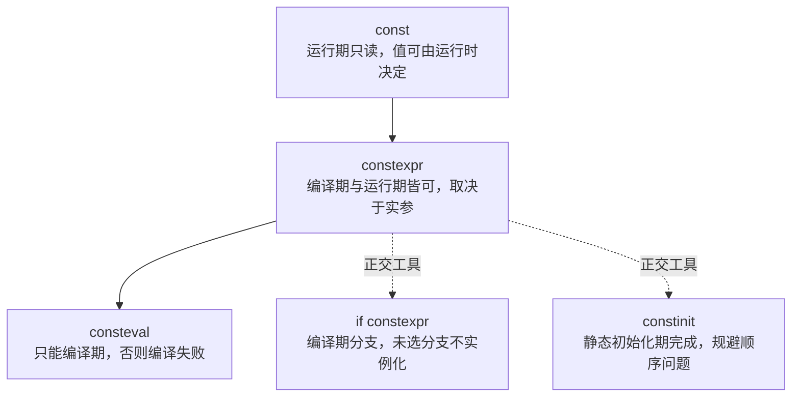
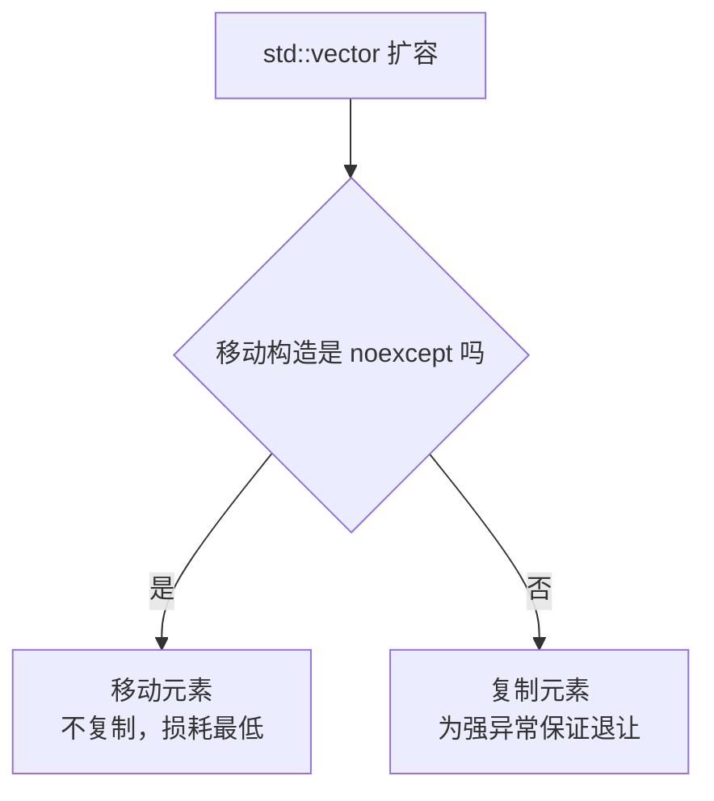
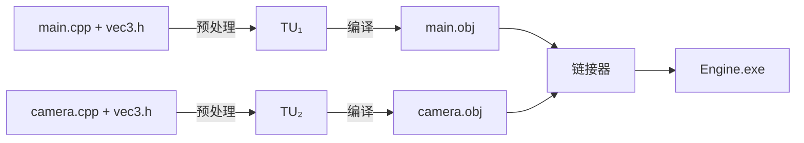

# C++ 语言特性实践

> [!abstract] 一句话结论
> C++ 语言层的小粒度知识统一汇总在本页——**一个关键字一节**，只记录用法、边界与工程约定。同类知识点在本页追加章节，**不另开文档**。

> [!important] 粒度规则
> 满足以下任一条，才在 `20-Knowledge/Concepts/` 新建独立 Concept 笔记：
> - 形成独立、可复用的技术问题域（资源绑定、GPU Barrier、Render Graph、内存分配器、着色器编译）；
> - 需要多份来源交叉比对，或需要整篇推导与图示才能讲清。
>
> 除此之外——单个关键字、单条语言规则、一段惯用法——一律并入本页新章节。
> 被项目正式采纳为实施约定后，写入对应 Decision 并在此链接，**不复制内容**。

## 目录

- [[#1. 编译期求值|1. 编译期求值]] —— `const` / `constexpr` / `consteval` / `constinit` / `if constexpr`
- [[#2. 异常契约|2. 异常契约]] —— `noexcept`
- [[#3. 翻译单元与链接性|3. 翻译单元与链接性]] —— 翻译单元 / ODR / `inline` / `static` / ADL
- [[#4. 待补章节|4. 待补章节]]
- [[#5. 笔记边界|5. 笔记边界]]

## 1. 编译期求值

### 1.1 语义阶梯

这几个关键字不是替代关系，而是**保证强度**与**作用维度**的差异：上行是编译期保证递增，下行是与求值正交的工具。



| 关键字 | 作用对象 | 编译期强制 | 标准 |
|---|---|---|---|
| `constexpr` | 变量 / 函数 / 构造函数 / 成员函数 | 否，视实参而定 | C++11（C++14 放宽多语句与循环） |
| `consteval` | 函数 | 是 | C++20 |
| `constinit` | 静态存储期变量 | 是（只约束初始化时机） | C++20 |
| `if constexpr` | 分支语句 | 是（丢弃未选分支） | C++17 |

### 1.2 用法

```cpp
// 1) 变量：编译期常量，可作数组尺寸与模板实参
constexpr int kMaxLights = 64;
const int     kSize = readConfig();    // 仅运行期只读，不能作数组尺寸

// 2) 函数：能否编译期求值由实参决定 —— 同一个函数两种命运
constexpr int square(int x) { return x * x; }
constexpr int a = square(5);           // 编译期算出 25
int n = readConfig();
int b = square(n);                     // 运行期调用，就是普通函数

// 3) 类：constexpr 构造 + 成员函数 → 字面类型，整个对象可编译期构造
struct Vec3 {
    float x, y, z;
    constexpr Vec3(float x_, float y_, float z_) noexcept : x(x_), y(y_), z(z_) {}
    constexpr float dot(const Vec3& o) const noexcept {
        return x * o.x + y * o.y + z * o.z;
    }
};
constexpr Vec3 kUp{0.f, 1.f, 0.f};     // 编译期构造，落只读段

// 4) consteval：强制编译期，违反直接编译失败（C++20）
consteval uint32_t fnv1a(std::string_view s) {
    uint32_t h = 2166136261u;
    for (char c : s) h = (h ^ uint8_t(c)) * 16777619u;
    return h;
}
constexpr auto kShadowPassId = fnv1a("shadow_pass");   // OK
// auto id = fnv1a(userInput);                         // 编译错误

// 5) if constexpr：编译期分支，替代 SFINAE（C++17）
template <typename T>
constexpr auto&& unwrap(T&& v) noexcept {
    if constexpr (std::is_pointer_v<std::remove_reference_t<T>>) return *v;
    else                                                         return std::forward<T>(v);
}

// 6) constinit：只保证静态初始化期就绪，不要求 const（C++20）
constinit Logger g_logger{};           // 规避 static initialization order fiasco
```

### 1.3 边界与陷阱

> [!warning] 容易搞错的地方
> - **`constexpr` 变量隐含 `const`，`const` 变量不隐含 `constexpr`** —— 两者不是同义词。
> - **`constexpr` 变量并非一概 `inline`**：C++17 起 *静态数据成员* 隐含 `inline`；命名空间作用域的 `constexpr` 变量因 `const` 而具**内部链接**，每个翻译单元一份。
> - **函数上 `constexpr` 隐含 `inline`**，且编译期求值需要看到函数体，所以定义必须对调用点可见（天然适合放头文件）。
> - **`constexpr` 不保证不产生运行时代码**，它只是"允许编译期求值"。
> - **C++11 的 `constexpr` 函数只能是单条 `return`**，多语句与循环是 C++14 才有；跨标准写库时容易踩。
> - **编译期 UB 直接编译失败**：越界、有符号溢出会让表达式不再是常量表达式。这等于免费的白盒测试。
> - **C++20 的编译期动态分配必须守恒**：`new` 可用，但求值结束时分配的内存必须全部释放，所以 `constexpr std::vector` 能造能用、**不能逃逸或返回**。
> - **`std::is_constant_evaluated()`** 可区分编译期与运行期路径，同一函数能写两套实现（编译期用朴素算法保证合法，运行期用 SIMD 加速）。

### 1.4 在渲染器中的落点

| 场景 | 做法 |
|---|---|
| 常量表 | `constexpr` 生成 Halton / Hammersley 序列、Bayer dither 矩阵、球谐系数 |
| 资源 ID | `consteval` 字符串哈希，`fnv1a("shadow_pass")` → 编译期定址，且可作 `case` 标签 |
| 数学库 | `Vec3` / `Mat4` 全量 `constexpr noexcept`，编译期可算的就不留到运行期 |
| 类型分派 | `if constexpr` 替代 SFINAE 与标签派发 |
| 全局对象 | `constinit` 保证静态初始化，避免初始化顺序依赖 |

## 2. 异常契约

### 2.1 语义

`noexcept` 声明的是**编译期契约**，不是运行时检查。它最实际的威力不在"标记不抛"，而在决定标准容器走**移动还是复制**——因为容器必须维持强异常安全保证。



### 2.2 用法

```cpp
// 1) 无条件 noexcept：明确不抛
void swap(Mesh& a, Mesh& b) noexcept;

// 2) 条件 noexcept：模板里绝不能写死，要和成员能力挂钩
template <typename T>
class Buffer {
public:
    Buffer(Buffer&& o) noexcept(std::is_nothrow_move_constructible_v<T>) = default;
    Buffer& operator=(Buffer&& o) noexcept(std::is_nothrow_move_assignable_v<T>) = default;
    ~Buffer() noexcept = default;          // 析构默认即 noexcept(true)
};

// 3) noexcept 运算符：查询表达式是否不抛，返回 bool，编译期可用
static_assert(noexcept(std::declval<Buffer<int>&>().~Buffer()));

// 4) 组合写法：外层是说明符、内层是运算符，语义完全不同
template <typename F>
void run(F&& f) noexcept(noexcept(f())) { f(); }   // f() 不抛 → run 才不抛

// 5) 标准库正是靠它做决策（move_if_noexcept）
template <typename T>
void vector<T>::reallocate() {
    if constexpr (std::is_nothrow_move_constructible_v<T>) move_elements();
    else                                                    copy_elements();
}
```

### 2.3 该标与不该标

| 该标 `noexcept` | 原因 |
|---|---|
| 析构函数 | 语言默认即 `noexcept(true)`，RAII 与容器强依赖 |
| `swap` | 影响 `std::sort`、`std::vector` 等所有泛型算法 |
| 移动构造 / 移动赋值 | **直接决定容器走 move 还是 copy，不标等于自动放弃优化** |
| 简单工具函数（`Vec3::dot`、getter、`size()`） | 零成本，且让编译器省掉 unwind table、利于内联与尾调用 |

| 不该标 | 原因 |
|---|---|
| 拿不准的普通函数 | 一旦抛出即 `std::terminate`，栈不展开，调试信息极差 |
| 会分配内存、可能 `bad_alloc` 的函数 | 本来可恢复的失败变成直接崩溃 |
| 虚函数覆盖 | 只能收紧不能放松：基类标了，派生类不能去掉 |
| 到处随手加 | 契约僵化，日后允许抛异常就是 ABI 破坏 |

### 2.4 边界与陷阱

> [!danger] 三个必须记住的认知
> 1. **`noexcept` 是编译期契约**。写错了不会有人报错，只会在异常那一刻 `terminate`——比抛异常难查得多。原则是：只在明确安全处标，不为"看起来更快"而标。
> 2. **`noexcept` 本身不直接加速代码**。收益来自两处间接效应：触发容器的 move 路径，以及给编译器更大的优化空间。
> 3. **C++17 起 `noexcept` 是函数类型的一部分**（影响函数指针类型与模板推导），C++17 之前不是 —— 跨版本代码要留意。

其余细节：

- **析构契约会传染**：若某个成员的析构可能抛，外层析构会退化为 `noexcept(false)`，容器与 RAII 行为随之改变。
- **lambda 默认不是 `noexcept`**，需要显式声明。
- **`noexcept(noexcept(x))` 与 `noexcept(x)` 别混**：前者是"条件修饰"，后者是"查询"。

### 2.5 与 `constexpr` 的协作形态

两者组合的典型签名是 `constexpr ... noexcept`：编译期求值 + 明确不抛，这是数学库与资源 ID 哈希的标配。

```cpp
constexpr uint32_t fnv1a(std::string_view s) noexcept;
constexpr float    dot(const Vec3& a, const Vec3& b) noexcept;
```

在渲染器语境下的落点：数学层全量 `constexpr noexcept`；资源名 → ID 用 `consteval` 哈希、编译期定址；GPU 句柄 RAII 包装的析构必须 `noexcept`；而 GPU API 的失败走返回码而非异常，天然契合这套契约；自定义容器的 `swap` 与移动构造一定标 `noexcept`，否则 GPU 缓冲数组扩容会退化为深拷贝。

## 3. 翻译单元与链接性

### 3.1 翻译单元（TU）

编译器**一次只看一个 `.cpp`**——这是理解 `inline` 与 `static` 的起点。单个 `.cpp` 经预处理（`#include` 文本展开、宏替换、条件编译裁剪）后的产物即一个**翻译单元（Translation Unit, TU）**，它是编译器真正的输入。**头文件本身不是 TU**，只是被文本复制进每一个包含它的 `.cpp`。



于是同一个头文件里的函数体会被**编译 N 遍**（N = 包含它的 `.cpp` 数量），产生 N 个同名符号。**链接器是唯一能同时看到全部 `.obj` 的角色**，`inline` 与 `static` 的全部差别就在于它给这些同名符号打什么标签。

ODR（One Definition Rule）正是按 TU 定义的：一个函数在所有 TU 中最多只能有一个定义，除非它是 `inline`、模板或类内定义的成员函数——后三类允许每个 TU 各有一份，但各份必须完全相同。

### 3.2 链接性对照

| 标记 | 符号标签 | 链接器行为 | 文件视角 |
|---|---|---|---|
| 无 | 全局强符号 | 同名出现多次 → 报错 | 编不过 |
| `static` | 局部符号（内部链接） | 各管各的，互不冲突 | **每个 TU 一份私有副本** |
| `inline` | 全局弱符号（MSVC: COMDAT / GCC、Clang: weak） | 保留一份，丢弃其余 | **所有 TU 共享一份** |
| `constexpr` | 同 `inline`（函数与静态数据成员隐含 `inline`） | 保留一份 | 共享一份 |
| `const` | 与链接无关 | 与链接无关 | 见下 |

`const` 是**类型限定符**，回答"能否被修改"，不回答"符号归谁"，对链接行为没有影响。唯一例外是历史兼容规则：**命名空间作用域的 `const` 变量默认内部链接**，等价于 `static`。

```cpp
const int kMax = 100;          // 内部链接，每个 TU 一份
inline const int kMax2 = 100;  // 加 inline 恢复外部链接，全局唯一
```

### 3.3 `static` 的真实陷阱

```cpp
// config.h
static int g_frame_count = 0;   // 每个 TU 各有一个副本

// main.cpp
#include "config.h"
void tick() { g_frame_count++; }            // 改的是 main.obj 里那一份

// render.cpp
#include "config.h"
int get_count() { return g_frame_count; }   // 读的是 render.obj 里那一份 → 恒为 0
```

编译链接全程无报错，行为却完全错误。换成 `inline int g_frame_count = 0;`（C++17 inline 变量）即恢复正常。

> [!warning] 结论
> 头文件里定义函数或变量**绝不能用 `static`**。`static` 的正确位置是 `.cpp` 内的文件私有辅助，现代写法更推荐匿名命名空间。

### 3.4 谁负责消除重复

**类内定义的成员函数隐含 `inline`**，所以 `vec3` 类内一个 `inline` 都不用写：

```cpp
class vec3 {
  public:
    constexpr double length_squared() const { ... }  // 类内定义 → 隐含 inline
};
```

而类外的自由函数（`operator<<`、`unit_vector`）没有这层保护，必须自带 `inline` 或 `constexpr`。

**`#pragma once` 管不了这件事**：它与 include guard 的作用域都是**单个 TU**，防的是同一个头在**一次**预处理中被重复粘贴（例如 A 直接包含 `vec3.h`，又通过 `camera.h` 间接包含）。**跨 TU 的重复定义由 `inline` 负责，两者不可互相替代。**

### 3.5 ADL 与非成员运算符

`std::cout << v` 中左操作数是标准库类型，**该运算符只能是非成员函数**——成员形式要求左操作数为 `vec3`，写出来是 `v << std::cout`，不成立。

编译器找到它靠 **ADL（实参依赖查找，Koenig 查找）**：因为实参类型是 `vec3`，编译器会把 `vec3` 所属命名空间一并纳入候选集合。因此**非成员运算符必须与类型定义在同一命名空间**。

```cpp
// vec3.h（全局命名空间）
inline std::ostream& operator<<(std::ostream& out, const vec3& v) { ... }

std::cout << v;   // ADL 在 vec3 所在命名空间找到 operator<<
```

> [!danger] 联动约束
> 一旦把 `vec3` 移入 `namespace alpha::math`，`operator<<`、`operator+`、`dot`、`cross` 等**所有非成员自由函数必须一并移入**，否则 ADL 失效，调用点立刻编译失败。

### 3.6 在渲染器中的落点

| 场景 | 做法 |
|---|---|
| 头文件里的函数 | `constexpr`（能标则标），否则 `inline` |
| 头文件里的全局变量 | `inline`（C++17） |
| `.cpp` 内的私有辅助 | `static` 或匿名命名空间 |
| 运算符重载 | 与类型同命名空间，依赖 ADL |
| 类内成员函数 | 无需修饰，隐含 `inline` |

### 3.7 边界与陷阱

- **`inline` 不是"把函数体展开到调用点"的指令**。C++ 中它的核心语义是链接规则；是否真正内联由优化器决定，与关键字无关（强制内联需 `__forceinline` / `__attribute__((always_inline))`）。
- **`inline` 不等于"文件内可见"**，那是 `static`（内部链接）。
- **`constexpr` 变量并非一概 `inline`**：静态数据成员自 C++17 起隐含 `inline`，但命名空间作用域的 `constexpr` 变量因 `const` 而具内部链接（见 1.3 节）。
- **ADL 依赖命名空间一致性**：把类型迁入新命名空间时，配套的非成员运算符必须同步迁移。

## 4. 待补章节

> [!note] 登记位
> 以下候选小知识点按需并入本页，**不单独建笔记**。补写时沿用本文档结构：语义 → 用法 → 边界与陷阱 → 在渲染器中的落点。

- const 正确性与接口设计（成员函数 const、按值/按引用参数）
- 移动语义、值类别与完美转发（`std::move` 的误用、RVO 与 NRVO）
- RAII 与资源所有权模型（移动后状态、`unique_ptr` 与 `shared_ptr` 的取舍）
- 模板约束与 concepts / `requires`（替代 SFINAE 与 `enable_if`）
- 类型推导（`auto`、`decltype`、CTAD 的陷阱）
- 初始化语义（`{}` vs `()`、聚合初始化、窄化转换）
- 整数与浮点边界（`size_t` 与有符号比较、浮点确定性与 `-ffast-math`）
- 未定义行为与优化假设（strict aliasing、`reinterpret_cast`、对象生命周期）
- 编译期字符串处理与资源 ID 哈希
- 内存对齐与布局（`alignas`、缓存行、SoA 与 AoS）

## 5. 笔记边界

| 内容 | 归属 |
|---|---|
| C++ 语言机制本身（本页） | 本 Concept 笔记 |
| 选定语言标准、构建基线、依赖管理 | 待 [[10-Outcomes/10-AlphaEngine]] 首版基线确认后 → Decision |
| 项目编码约定（是否强制 `constexpr noexcept`、命名、格式化、头文件定义与 `inline`/`static` 边界） | 基线确认后 → Decision，本页只链接不复制 |
| 图形 API 资源绑定、Barrier、Render Graph | 独立 Concept 笔记（尚未建立） |
| 项目专有名词口径 | [[20-Knowledge/Glossary]] |
| 语言规范与标准文本依据 | [[30-Sources/C++-标准与cppreference]] |

## 6. 依据

- [[30-Sources/C++-标准与cppreference]] —— 语言标准行为与等价入口。
- 本文档的工程约定部分（1.4 / 2.3 / 2.5 / 3.6 的落点判断）为**内部推导**：基于语言规则与实时渲染的常见约束得出，尚未经项目实测验证。

## 7. 待核验

- 语言标准基线未定（见 [[10-Outcomes/10-AlphaEngine]]），本文档中 C++17 / C++20 特性的可用性随该决策确定；基线落位后需回头标注可用范围。
- "数学库全量 `constexpr noexcept`""资源 ID 用 `consteval` 哈希"等倾向是否升级为项目编码约定，待基线确认。
- 3.6 节的头文件定义与链接约定（`inline` 的适用范围、类型命名空间划分）属内部推导，待基线确认后决定是否升级为项目约定。
- 各章节的渲染器落点为推导结论，需在首个里程碑中实测验证后再提升为基线。
