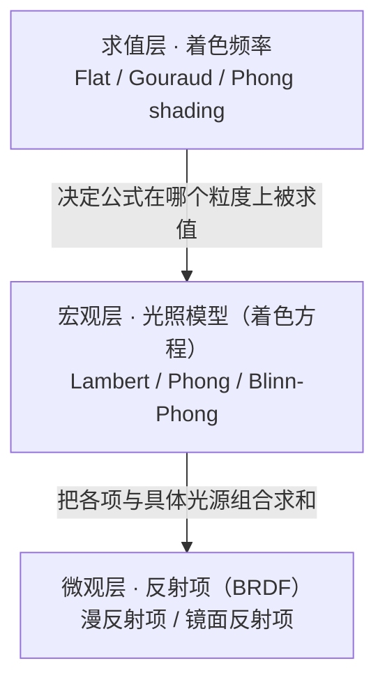
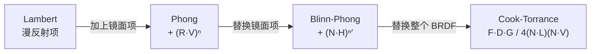

# 光照模型

> [!abstract] 一句话结论
> 光照模型相关术语之所以容易记混，是因为**同一个词在三层不同的抽象上被反复复用**：反射项（BRDF）、光照模型（着色方程）、着色频率。其中 `Phong` 一词同时占据三层。本页按这三层组织，逐层给出公式、推导、图示、边界与工程含义。

> [!important] 粒度规则
> 本页是**着色与光照**主题的聚合页。满足以下任一条才另立 Concept 笔记：
> - 形成独立技术问题域（采样与积分、颜色空间与传输函数、微表面理论）；
> - 需要多份来源交叉比对，或需要整篇推导才能讲清。
>
> 除此之外——单个光照模型、单个 BRDF 项、一条数值技巧——一律并入本页新章节。

## 目录

- [[#1. 三个层级的分离|1. 三个层级的分离]]
- [[#2. 兰伯特漫反射|2. 兰伯特漫反射]]
- [[#3. Phong 光照模型|3. Phong 光照模型]]
- [[#4. Blinn-Phong 的替换|4. Blinn-Phong 的替换]]
- [[#5. 光源类型与距离衰减|5. 光源类型与距离衰减]]
- [[#6. 着色频率|6. 着色频率]]
- [[#7. 演进方向：从 Phong 到 PBR|7. 演进方向：从 Phong 到 PBR]]
- [[#8. 在渲染器中的落点|8. 在渲染器中的落点]]
- [[#9. 笔记边界|9. 笔记边界]]
- [[#10. 依据|10. 依据]]
- [[#11. 待核验|11. 待核验]]

## 1. 三个层级的分离

### 1.1 为什么必须先分层

若把"光照模型"当成一个整体概念去记，会同时遇到三组互相矛盾的经验：

- 有人说漫反射就是 `N·L`，也有人说漫反射要除以 π；
- 有人说 Phong 需要算反射向量，也有人说不需要；
- 有人把 Phong 和 Lambert 说成并列选项，也有人坚持 Phong 包含 Lambert。

这三组矛盾的根源不在公式，而在于**提问者所在的层级不同**。先把层级切开，公式各自归位，记忆负担立刻下降。

### 1.2 层级定义



| 层级 | 回答的问题 | 输入 / 输出 | 典型成员 |
|---|---|---|---|
| **L1 反射项（BRDF）** | 光打到表面后，如何被重新分配到各个出射方向？ | 入射方向、出射方向、法线 → 反射比率 | 漫反射项、镜面反射项 |
| **L2 光照模型（着色方程）** | 表面上有若干个光源，各自贡献怎么加起来？ | 光源参数、材质参数、几何量 → 出射辐射亮度 | Lambert、Phong、Blinn-Phong |
| **L3 着色频率** | 这个公式在几何图元的哪个粒度上被算一次？ | 几何图元 → 每个图元的着色结果 | Flat、Gouraud、Phong shading |

三个层级**正交**，可以任意组合。这是本页最重要的一句话。

### 1.3 术语对照表

| 名称 | 层级 | 角色 | 核心形式 |
|---|---|---|---|
| Lambert 漫反射 | L1 | 反射项 | `ρ / π` |
| Phong 高光 | L1 | 反射项 | `(R·V)ⁿ` |
| Blinn-Phong 高光 | L1 | 反射项 | `(N·H)ⁿ′` |
| Phong 光照模型 | L2 | 着色方程 | 环境 + 漫反射 + 镜面 |
| Blinn-Phong 光照模型 | L2 | 着色方程 | 同上，镜面项换成 `(N·H)ⁿ′` |
| Flat shading | L3 | 求值频率 | 每三角形求值一次 |
| Gouraud shading | L3 | 求值频率 | 每顶点求值一次，颜色插值 |
| Phong shading | L3 | 求值频率 | 每像素求值一次，法线插值 |

> [!warning] 混乱的真正来源
> `Phong` 同时出现在 **L1（高光项）**、**L2（光照模型）**、**L3（shading 方式）** 三行里。它们只是同名，含义、公式、适用场景都不同。
>
> 遇到 `Phong` 时先问一句"这是哪一层"，绝大部分困惑会当场消失。

两个最常见的误判：

1. **"Phong 和 Lambert 谁替代谁"** —— 不存在替代关系。Phong 光照模型的漫反射项**就是** Lambert，它是超集而非后继。
2. **"用了 Phong shading 就是用了 Phong 光照模型"** —— 无关。它们是 L3 与 L2 的独立选择，`Lambert 光照 + Phong shading` 是完全合法的组合。

### 1.4 各光照模型的完整公式并排

这是最容易记混的地方，一次列清。三者是**逐层叠加**的关系，`Lambert` 是裸露的漫反射，`Phong` 在其上加镜面项，`Blinn-Phong` 只换镜面项的向量。

| 光照模型 | 完整着色方程 | 镜面项 |
|---|---|---|
| **Lambert** | `L = k_a·I_a + k_d·(N·L)·I_d` | 无 |
| **Phong** | `L = k_a·I_a + k_d·(N·L)·I_d + k_s·(R·V)ⁿ·I_s` | `(R·V)ⁿ`，需先算 `R` |
| **Blinn-Phong** | `L = k_a·I_a + k_d·(N·L)·I_d + k_s·(N·H)ⁿ′·I_s` | `(N·H)ⁿ′`，需先算 `H` |

其中 `R = 2(N·L)N - L`，`H = normalize(L + V)`。

> [!tip] 三项各自独立，可单独替换
> 这是理解整个演进路径的关键：把镜面项从 `(R·V)ⁿ` 换成 `(N·H)ⁿ′` 就得到 Blinn-Phong；把三项整体换成 Cook-Torrance 就进入 PBR。**不需要推倒重来，只需替换其中的项。**

## 2. 兰伯特漫反射

### 2.1 辐射度量与符号约定

光照公式中符号混用是最常见的严谨性缺口。先固定本页的约定。

| 量 | 符号 | 定义 | 单位 |
|---|---|---|---|
| 辐射通量 radiant flux | `Φ` | 单位时间通过的总能量 | W |
| 辐射照度 irradiance | `E` | `dΦ / dA`，到达单位面积表面的功率 | W/m² |
| 辐射强度 radiant intensity | `I` | `dΦ / dω`，点光源向单位立体角发射的功率 | W/sr |
| 辐射亮度 radiance | `L` | `d²Φ / (dA⊥ · dω)`，沿某方向、单位投影面积、单位立体角内的功率 | W/(m²·sr) |

两条关键关系：

```
E = ∫_Ω L · cosθ dω        照度是亮度的半球加权积分
E = I / r²                  点光源的照度随距离平方衰减（见 5.3）
```

> [!important] 为什么渲染方程求解的是 `L` 而不是 `E`
> 因为**辐射亮度在无遮挡的真空中沿光线传播不变**。这一性质使"沿光线反向追溯"成为可能：我们可以从相机出发发射光线，把每一步的 `L` 累加起来。
>
> `E` 不具备这个性质（`1/r²` 衰减就是在描述 `E` 如何变化）。若渲染方程以 `E` 为未知量，就无法用光线追踪求解。

**工程惯例的偏差**：大量图形学教程用 `I` 泛指"光源强度/颜色"，不区分 `I` 与 `L`，也不写量纲。本页沿用工程写法（`I_d`、`I_s`、`I_a`），但在涉及 `1/r²` 衰减（第 5 节）与 `1/π` 归属（2.5）时会明确说明其物理对应。

### 2.2 朗伯余弦定律

**朗伯表面**（Lambertian surface）是理想的漫反射表面：反射辐射在所有出射方向上均匀分布。

先看入射端。设一束平行光的垂直截面面积为 `A⊥`，光通量为 `Φ`。光以夹角 `θ` 打到表面上（`θ` 为光线方向与表面法线的夹角）：

```
     垂直入射                    斜射 θ = 60°

        ↓ ↓ ↓                       ↘ ↘ ↘
        ↓ ↓ ↓                         ↘ ↘ ↘
        ↓ ↓ ↓                           ↘ ↘ ↘
   ═══════════════                 ═════════════════════
       ├────┤                        ├──────────┤
          A⊥                            A = 2·A⊥
        （1 倍宽）                       （2 倍宽）

   E = Φ / A⊥                        E = Φ / A
     = E⊥（最亮）                      = E⊥ · cos60°
                                      = 0.5 · E⊥
```

光斑面积被拉长为：

```
A = A⊥ / cosθ
```

辐射照度因此为：

```
E = Φ / A = Φ · cosθ / A⊥ = E⊥ · cosθ
```

其中 `E⊥` 是垂直入射时的照度。得到：

```
E ∝ cosθ
```

因为 `N` 与 `L` 均为单位向量，`N·L = cosθ`，于是：

```
E = E⊥ · (N·L)
```

> [!important] `N·L` 不是模型假设，是几何必然
> 余弦因子来自**入射端的投影面积关系**，与表面是漫反射还是镜面反射无关。渲染方程里的 `(N·L)` 项就是这个因子的位置。任何 BRDF 都共用它。

### 2.3 漫反射 BRDF 与 `1/π`

**BRDF 的正式定义**（双向反射分布函数）是「出射辐射亮度增量」与「入射辐照度增量」之比：

```
f_r(ω_i, ω_o) = dL_o(ω_o) / dE_i(ω_i)
```

把 `dE_i = L_i(ω_i) · (N·ω_i) · dω_i` 代入，得到更常用的形式：

```
f_r(ω_i, ω_o) = dL_o(ω_o) / ( L_i(ω_i) · (N·ω_i) · dω_i )
```

`ω_i` 是入射方向，`ω_o` 是出射方向，`N` 是表面法线。

BRDF 的两条基本性质：

| 性质 | 表述 | 含义 |
|---|---|---|
| **互易性** | `f_r(ω_i, ω_o) = f_r(ω_o, ω_i)` | 交换光路方向，反射比率不变 |
| **能量守恒** | `∫_Ω f_r · (N·ω_o) dω_o ≤ 1` | 反射出去的能量不超过入射 |

**漫反射 BRDF 是一个常量**——反射强度与出射方向无关：

```
f_d = ρ / π
```

`ρ` 是 albedo（单次反射率），取值 `[0, 1]`。

`π` 不是凑数。把常量代入能量守恒条件，需要计算半球上的余弦积分：

```
∫_Ω cosθ dω = ∫₀²π ∫₀^(π/2) cosθ · sinθ dθ dφ
             = 2π · [sin²θ / 2]₀^(π/2)
             = 2π · 1/2
             = π
```

（内层积分 `∫ cosθ sinθ dθ = sin²θ / 2`；`sinθ` 是球面微元的 Jacobi 因子 `dω = sinθ dθ dφ`。）

代回守恒条件：

```
∫_Ω f_d · cosθ_o dω_o = (ρ/π) · π = ρ ≤ 1    ✓
```

只有当 `f_d = ρ/π` 时，反射出去的能量才恰好等于 `ρ` 倍的入射能量。若写成 `f_d = ρ`，则反射率为 `ρπ`，`ρ > 1/π` 时就已超过 1，能量不守恒。

> [!tip] 为什么偏偏是 π —— 量纲给出的答案
> BRDF 的量纲是 `1/sr`（分子是 radiance，分母含立体角），而半球余弦积分 `∫cosθ dω` 的量纲是 `sr`。两者相乘，量纲相互抵消，得到无量纲的反射率。`π` 正是这个 `sr` 换算的具体数值结果。
>
> 记住"BRDF 带 `1/sr`"，`1/π` 就不再需要死记。

### 2.4 渲染方程中的形式

渲染方程的完整形式包含自发光项：

```
L_o(x, ω_o) = L_e(x, ω_o) + ∫_Ω f_r · L_i(x, ω_i) · (N·ω_i) dω_i
```

`L_e` 是表面自身发射的辐射亮度（emissive），对非自发光表面 `L_e = 0`。

直接光照（只考虑光源本身，不含间接光）下引入可见性函数 `V`：

```
L_direct(x, ω_o) = ∫_Ω f_r · L_i · (N·ω_i) · V(x, x′) dω_i
```

`V(x, x′) ∈ {0, 1}` 表示从表面点 `x` 到光源点 `x′` 之间是否无遮挡——**这就是阴影项**。Phong 系列光照模型全都不含 `V`，因此没有阴影。

对常量 `f_d = ρ/π` 且入射辐射 `L_i` 在半球上均匀的情形：

```
L_o = (ρ/π) · L_i · ∫ (N·L) dω_i
    = (ρ/π) · L_i · π
    = ρ · L_i
```

**验证**：`ρ = 1` 的完美白表面在均匀光下，出射亮度等于入射亮度。这符合直觉——白纸在白光下和白光一样白。

### 2.5 `1/π` 在实时渲染中的归属

这是一个实际工程中**必然踩到**的坑。

直接光照下，漫反射项严格写法是：

```
L_d = (ρ / π) · I · (N·L)
```

但工程上有两种等价写法：

| 写法 | 公式 | 含义 | 何时出现 |
|---|---|---|---|
| **A. 保留 π** | `L_d = (ρ/π) · I · (N·L)` | 光源数值是物理辐射强度 | 路径追踪、离线渲染、物理单位流程 |
| **B. 折进光源** | `L_d = ρ · I′ · (N·L)`，其中 `I′ = I/π` | 光源数值吸收了 `1/π` | 大量光栅化教程与简单前向渲染 |

**判据**：看漫反射项是否除以 π。若 shader 里看不到 π，说明 π 已被折进光源强度或光照归一化。

> [!warning] 混用会导致 π 倍亮度偏差
> 同一场景里若一部分光源用 A 约定、另一部分用 B 约定（或环境光用 A、直接光用 B），画面亮度会失衡约 `3.14` 倍。这是"背光面莫名偏亮/偏暗"类问题的常见成因。
>
> 多光源求和时尤其要检查：每一项的 `1/π` 归属必须一致。

### 2.6 边界与陷阱

- **忘记钳制 `max(0, N·L)`。** 背面（`N·L < 0`）会产生负的漫反射贡献，使结果变暗甚至出现负色值。必须钳制到 0。
- **法线未归一化时 `N·L` 不是余弦。** 插值后的法线长度会缩短（见 6.3），长度不为 1 时点积被错误缩放，表现为亮度偏低且不均匀。`hit_record::normal` 在球体求交中由 `(P - C) / r` 得到，天然单位化；但从其他来源取得法线时需显式归一化。
- **`π` 归属不统一。** 见 2.5。
- **在线性空间之外做光照乘法。** 漫反射是能量乘法，必须在**线性空间**进行。若在 sRGB 编码值上直接相乘，明暗过渡会失真。颜色空间与传输函数的完整讨论另立 Concept 笔记。
- **忽略 `L_e`。** 若后续要渲染光源自身（面光源、自发光材质），渲染方程必须保留 `L_e` 项，否则光源在画面中不可见。

## 3. Phong 光照模型

### 3.1 三项结构

Phong 光照模型把出射亮度拆成三项之和：

```
        ┌──────────────────────────────────────────────┐
        │            L = 环境 + 漫反射 + 镜面            │
        │                                              │
        │   ┌────────┐   ┌────────┐   ┌────────────┐  │
        │   │ 环境光  │ + │ 漫反射  │ + │  镜面反射   │  │
        │   │ k_a·I_a│   │ (N·L)  │   │  (R·V)ⁿ    │  │
        │   │  常数   │   │=Lambert│   │ =Phong 高光 │  │
        │   └────────┘   └────────┘   └────────────┘  │
        │        ↑             ↑              ↑        │
        │     虚构补偿      物理 BRDF      物理 BRDF    │
        └──────────────────────────────────────────────┘
```

三者的物理地位完全不同：环境光是**虚构的补偿项**，漫反射和镜面反射才是 BRDF 的实际组成。

### 3.2 环境光项

```
L_a = k_a · I_a
```

`k_a` 是材质的环境反射系数，`I_a` 是环境光强度（一个常数）。

**性质**：与法线无关、与光源位置无关、与视点无关。它给所有表面一个均匀的最低亮度。

**它不物理。** 真实世界中，背光面由**间接光**（周围表面反射来的光）照亮，这是一个依赖场景的全局量。环境光是它的常数占位符——代价是背光面完全没有明暗变化，物体看起来"发灰发平"。

现代替代方案：IBL（基于图像的光照）用环境贴图提供方向相关的间接光；GI（全局光照）直接求解间接光的传播。AlphaEngine 若走路径追踪路线，环境光项将被渲染方程的自然求解过程取代。

### 3.3 漫反射项

```
L_d = k_d · (N·L) · I_d
```

`k_d` 是材质漫反射系数，`I_d` 是光源强度。

**注意**：这是 2.5 中「写法 B」的简化形式，**不含 `1/π`**。物理严格形式见第 2 节。

### 3.4 镜面反射项（Phong 高光）

先定义反射向量。约定 `L` 为「表面点 → 光源」的单位向量，`N` 为单位法线。

```
                N
                ↑
                │
         L ↘    │    ↗ R
            ↘   │   ↗
             ↘  │  ↗
              ↘ │ ↗
     ──────────●─────────────  表面
                │

    L 与 N 的夹角  =  R 与 N 的夹角     （R 是 L 关于 N 的镜像）
    垂直入射（L = N）时 R = N，反射沿原路返回
```

对任意方向向量 `d`，关于单位法线 `N` 的镜面反射为：

```
r = d - 2(d·N)N
```

光线沿 `-L` 方向射入表面，代入 `d = -L`：

```
R = (-L) - 2((-L)·N)N
  = -L + 2(N·L)N
  = 2(N·L)N - L
```

**验证**：当 `L = N`（垂直入射）时，`R = 2N - N = N`，反射方向与入射方向重合，符合镜面反射的预期。

高光项：

```
L_s = k_s · (R·V)ⁿ · I_s
```

`V` 是「表面点 → 视点」的单位向量，`n` 是光泽度指数（shininess），`I_s` 是光源强度。

`R·V = cos α`，`α` 是反射方向与视线的夹角。于是：

- `α = 0`（视线与反射方向对齐）时 `(R·V)ⁿ = 1`，高光最强；
- `n` 越大，衰减越快，高光越尖锐，表面显得越光滑。

### 3.5 完整形式与多光源求和

单光源：

```
L = k_a·I_a + k_d·(N·L)·I_d + k_s·(R·V)ⁿ·I_s
```

多光源时，**漫反射与镜面项对每个光源分别求和，环境光只加一次**：

```
L = k_a·I_a + Σ_i [ k_d·(N·L_i)·I_d,i + k_s·(R_i·V)ⁿ·I_s,i ]

    其中 R_i = 2(N·L_i)N - L_i        （每个光源的反射向量不同）
```

`Σ_i` 遍历所有光源。注意 `N` 对所有光源相同，而 `L_i`、`R_i`、`I_d,i`、`I_s,i` 逐光源变化。

> [!warning] 环境光不能放进循环
> 若把 `k_a·I_a` 写在 `Σ_i` 内部，有几个光源就会累加几次，导致环境光强度随光源数量漂移。这是"加了一盏灯，整个场景都变亮了"这类现象的典型成因。

### 3.6 边界与陷阱

- **`R` 的公式依赖 `L` 的方向约定。** 若把 `L` 定义为「光源 → 表面」（与图形学惯例相反），`R` 的符号会不同。**统一约定：`L`、`V`、`N` 三者都从表面点指向外侧。**
- **`(R·V)` 可能为负，必须钳制。** 当 `α > 90°` 时 `R·V < 0`。对负数取非整数次幂会得到 `NaN`（而不是简单的负值）。这是真实的渲染 bug 来源，表现为零星黑块或整片 NaN 扩散。
- **环境光被重复累加。** 见 3.5。
- **`k_a + k_d + k_s` 无任何约束。** 三者之和可以大于 1，此时反射能量超过入射能量。Phong 模型本身就允许这种非物理配置。
- **高光的"边缘硬截断"。** 当 `α` 越过 `90°` 时，`(R·V)ⁿ` 从正直接跳到被钳制的 0，高光边界出现可见的硬边。这是 Phong 相比 Blinn-Phong 的主要视觉缺陷（见 4.5）。

## 4. Blinn-Phong 的替换

Blinn-Phong 只对 Phong 的**镜面项**做了一处替换，其余部分完全相同。

### 4.1 半角向量

```
H = normalize(L + V)
```

几何意义：`H` 是 `L` 与 `V` 的**角平分方向**。

镜面项变为：

```
L_s = k_s · (N·H)ⁿ′ · I_s
```

### 4.2 夹角关系 `β = α/2`

设 `N` 为 `0°` 参考方向，`L` 位于 `−θ_L`，`V` 位于 `+θ_V`（`L`、`V`、`N` 共面）。

- `R` 是 `L` 关于 `N` 的镜像，因此位于 `+θ_L`；
- Phong 测量的夹角是 `α = |θ_L − θ_V|`，即 `R` 与 `V` 的夹角；
- `H` 平分 `L` 与 `V`，方向为 `((+θ_V) + (−θ_L)) / 2 = (θ_V − θ_L) / 2`；
- Blinn-Phong 测量的夹角是 `β = |θ_V − θ_L| / 2`。

以 `L = −45°`、`V = +20°` 为例：

```
  −45°        −12.5°       0°        +20°        +45°
    L            H          N          V           R
    │            │          │          │           │
  ──┴────────────┴──────────┴──────────┴───────────┴─────

  Phong 测量： α = |R − V|   = |+45° − (+20°)| = 25°
  Blinn 测量： β = |H − N|   = |−12.5° − 0°|   = 12.5°
```

因此：

```
β = α / 2
```

**半角向量把被测量的夹角缩小了一半。** 这一点解释了两个模型的指数差异。

### 4.3 指数换算：约 4 倍

由 `α = 2β` 得 `cos α = 2cos²β − 1`。在小角度下作二阶展开：

```
cos α ≈ 1 − α²/2
cos β ≈ 1 − β²/2 = 1 − α²/8
```

两边分别取幂并写成指数形式：

```
(cos α)ⁿ   ≈ exp(−n · α²/2)
(cos β)ⁿ′  ≈ exp(−n′ · α²/8)
```

要让两条衰减曲线在近轴处重合，需 `n′/8 = n/2`，即：

```
n′ ≈ 4n
```

> [!note] 这是文献结论，非本页首创
> 「Blinn 的指数取 Phong 的 4 倍时两者高光相近」这一关系出自 Fisher & Woo 的专门分析，其结论表述为 `(N·H)^4r ≈ (R·E)^r`（该文的 `E` 即本页的视线向量 `V`）。见第 10 节依据。
>
> 该换算仅在小角度（高光核心附近）成立。远离核心时两个模型的高光**形状**本身不同，不存在精确的指数映射。若追求视觉一致，应以实际渲染结果调参，而非套用 4 倍公式。

### 4.4 完整形式

把替换代回 3.5 的单光源式子：

```
L = k_a·I_a + k_d·(N·L)·I_d + k_s·(N·H)ⁿ′·I_s

    H = normalize(L + V)
```

与 Phong 的差别**仅在中括号内的镜面项**：`(R·V)ⁿ` → `(N·H)ⁿ′`，且少了一次反射向量的构造。多光源求和形式与 3.5 完全相同，只是 `R_i` 换成 `H_i = normalize(L_i + V)`。

### 4.5 为什么 Blinn-Phong 成为主流

| 方面 | Phong | Blinn-Phong |
|---|---|---|
| 需否计算 `R` | 需要，`R = 2(N·L)N − L` | 不需要，`H = normalize(L+V)` |
| 每像素运算量 | 较高 | 略低（省一次向量构造与点积） |
| 掠射角高光行为 | `α > 90°` 时 `(R·V)` 为负，高光被**硬截断** | 衰减更平缓，无硬截断 |
| 与后续模型的衔接 | 反射向量 `R` 在 PBR 中不再出现 | 半角向量 `H` 被 GGX 沿用 |

第三行是关键的视觉差异：Phong 在掠射角下高光会在边界处突然消失，形成可见的硬边；Blinn-Phong 的过渡更自然。第四行则解释了为什么 PBR 时代仍能见到 `H`——GGX 的法线分布函数 `D(H)` 正是以半角向量为自变量（见 7.4）。

### 4.6 边界与陷阱

- **`L + V` 的退化条件。** 当 `L ≈ −V` 时 `normalize` 会除零。不过在有效光照区域内这不会发生：若 `N·L > 0` 且 `N·V > 0`，则 `L` 与 `V` 位于同一半球，两者之和不可能为零向量。**工程做法：在 `N·L ≤ 0` 时直接跳过镜面项计算**，既避免了退化，也省去了无效运算。
- **指数语义不同，不可直接互换。** 见 4.3。把 Phong 的 `n = 32` 直接搬到 Blinn-Phong 会得到明显更宽的高光。
- **半角向量必须归一化。** 与法线同理，`N·H` 依赖 `H` 为单位向量。
- **两者都不是物理模型。** Blinn-Phong 更便宜、视觉更可接受，但它同样不满足能量守恒、不含菲涅尔与几何遮蔽。它是工程近似，不是 PBR 的过渡阶段。

## 5. 光源类型与距离衰减

前三节只写了"对一个光源"如何着色。这一节补上光源本身的分类与衰减——这是把光照模型真正接进渲染器的必要一环。

### 5.1 三类光源

| 类型 | 方向 | 位置 | 距离衰减 | 典型用途 |
|---|---|---|---|---|
| **方向光** Directional | 全局恒定（平行光） | 视作无穷远 | 无 | 太阳、月光 |
| **点光源** Point | 随表面点变化 | 有限点 | `1 / r²` | 灯泡、火花 |
| **聚光灯** Spot | 随表面点变化 | 有限点 + 朝向 | `1 / r²` × 角度衰减 | 手电筒、舞台灯 |

三者的区别只在**如何得到 `L`** 和**是否乘衰减系数**；一旦拿到单位化的 `L`，代入 3.5 / 4.4 的着色方程的方式完全相同。

### 5.2 方向光

光线方向 `L` 对所有表面点相同（由光源配置直接给定，无需计算）：

```
L = normalize(-light_direction)      （表面 → 光源的方向）

L_d = k_d · (N·L) · I_d              （无距离衰减）
```

**它近似的是"距离足够远"的光源**——太阳的锥角小于 1°，在地表尺度上可视为平行光。

> [!warning] 方向光不应加距离衰减
> 距离衰减属于"有限距离光源"的性质。给方向光乘 `1/r²` 会得到完全错误的结果（且 `r` 无定义）。这是从点光源代码复制粘贴时的常见错误。

### 5.3 点光源与 `1/r²`

```
L_vec = light_pos − p            （表面点 p → 光源）
r     = |L_vec|
L     = L_vec / r                （单位化后才能代入着色方程）

E = I / r²                       （辐照度随距离平方衰减）
```

**`1/r²` 的来源**是能量守恒。点光源向各方向均匀发射总功率 `Φ`，在半径 `r` 的球面上功率密度为：

```
E = Φ / (4πr²)
```

而辐射强度定义为 `I = Φ / (4π)`（单位立体角的功率），于是：

```
E = I / r²
```

光传播得越远，同样的能量摊在越大的球面上——这和 2.2 的余弦定律是同一种"摊开"的几何。

**工程软化**：纯 `1/r²` 在 `r → 0` 时发散，且近场数值巨大。实际实现会加保护：

```
E = I / max(r², ε)              或用 I / (r² + ε)
```

`ε` 取一个小的正数（如 `1e-4`）。这会轻微破坏远处的能量守恒，但避免了零距离处的 `inf`。

### 5.4 聚光灯

聚光灯在点光源基础上再乘一个**角度衰减**。设光源位置 `P`、朝向单位向量 `dir`，表面点 `p`：

```
v     = normalize(p − P)         （光源 → 表面）
cosφ  = dot(v, dir)              （φ = 0 表示正对锥心）
```

用内外锥角做平滑过渡：

```
spot = clamp( (cosφ − cos φ_outer) / (cos φ_inner − cos φ_outer), 0, 1 )
```

其中 `φ_inner < φ_outer`（内锥更窄），因此 `cos φ_inner > cos φ_outer`，分母为正。

另一种更简单的写法是幂次衰减：

```
spot = pow( max(cosφ, 0), p )    （p 越大，边缘越锐利）
```

最终贡献：

```
L_spot = k_d · (N·L) · I_d · (1/r²) · spot
```

### 5.5 边界与陷阱

- **`1/r²` 在 `r → 0` 时数值发散。** 必须加 `ε` 保护，否则出现 `inf` 并污染整帧。
- **光源位于表面背后时仍会被计算。** 若不做 `max(0, N·L)` 钳制，背面的光源会贡献负值。方向光、点光源、聚光灯都适用。
- **`L` 未归一化。** 点光源与聚光灯的 `L` 由位置差算出，必须单位化后使用；否则 `N·L` 会被距离缩放，表现为亮度随距离异常变化。
- **距离衰减与 `1/π` 归属混淆。** `1/r²` 描述的是**辐照度** `E` 的衰减，与 2.5 的 `1/π`（BRDF 归一化）是两个独立的因子，不可互相替代。
- **阴影缺失。** 三类光源在 Phong 系列中都不含可见性项 `V`（见 2.4）。点光源和聚光灯的"光穿墙"问题需要额外的阴影贴图或光线求交才能解决。

## 6. 着色频率

### 6.1 三种频率

```
   Flat shading            Gouraud shading          Phong shading
   ─────────────           ───────────────          ─────────────
   法线 = 面法线            法线 = 顶点法线           法线 = 插值后归一化
   求值 = 每面一次          求值 = 每顶点一次         求值 = 每像素一次

   ┌─────────┐            ●─────────●              ●─────────●
   │    █    │            │ · · · · │              │ · · · · │
   │         │            │ ·  ·  · │              │ · · · · │
   │         │            │ · · · · │              │ · · · · │
   └─────────┘            ●─────────●              ●─────────●
    █ = 求值点              ● = 求值点                · = 求值点

   棱线可见                平滑，但高光可能丢失      高光位置与形状正确
```

| 方式 | 求值粒度 | 使用法线 | 成本 | 特征 |
|---|---|---|---|---|
| **Flat shading** | 每三角形一次 | 面法线 | 最低 | 棱角分明，暴露多边形结构 |
| **Gouraud shading** | 每顶点一次，颜色线性插值 | 顶点法线 | 低 | 平滑但高光易丢失 |
| **Phong shading** | 每像素一次，法线线性插值 | 插值后归一化的法线 | 较高 | 高光正确 |

**Gouraud 的高光缺陷**：高光是随视角快速变化的高频信号，而顶点采样是固定的。若高光区域落在三角形内部而未覆盖任何顶点，插值结果中高光**完全消失**。表现是高光在物体表面闪烁、断裂，随相机移动跳变。

**Phong shading 的额外成本**：需要逐像素插值法线并重新归一化（每次归一化含一次开方）。

### 6.2 与光照模型的解耦（本页核心）

> [!important] `Phong shading` ≠ `Phong 光照模型`
> 两者只是同名，彼此正交。任意组合都合法：
>
> | 光照模型（L2） | 着色频率（L3） | 是否常见 |
> |---|---|---|
> | Lambert | Phong shading | 常见（现代纹理化表面的基础） |
> | Phong | Gouraud shading | 常见（旧硬件、低端移动端） |
> | Phong | Phong shading | 最常见（经典组合，因此同名易混） |
> | Blinn-Phong | Phong shading | 常见（前向渲染主流） |
> | Blinn-Phong | Flat shading | 常见（低多边形风格化） |
>
> "用了 Phong shading" **只说明求值粒度是逐像素**，与是否使用 Phong 高光项毫无关系。

### 6.3 边界与陷阱

- **插值后的法线必须重新归一化。** 两个单位向量的线性插值结果长度小于 1，且越靠近中点越短（夹角 90° 时中点长度约 `cos45° ≈ 0.707`）。若不归一化，`N·L` 会被整体缩小，表现为曲面亮度偏低且出现不均匀的暗带。
- **顶点法线需要加权平均。** 简单的算术平均会让相邻面片贡献不均，在曲率变化处产生明暗跳变。常用做法是按相邻面的**夹角**或**面积**加权。
- **硬边需要拆分顶点。** 立方体这类需要在棱边保持硬边的几何体，必须为每条棱复制顶点并赋予不同法线，否则 Gouraud / Phong shading 会把棱边插值成圆角。
- **Gouraud shading 下高光闪烁。** 见 6.1。
- **求值频率不改变光照模型本身。** 同一套 `k_a / k_d / k_s` 参数在三种频率下含义相同，只是求值位置不同。不要因为换了 shading 方式就重新调参。

## 7. 演进方向：从 Phong 到 PBR

### 7.1 演进链

每次演进都只替换其中一项，而非推倒重来：



### 7.2 Phong 的物理缺陷

| # | 缺陷 | 后果 |
|---|---|---|
| 1 | 不满足能量守恒 | `k_a + k_d + k_s` 无约束，反射可超过入射 |
| 2 | 高光项无物理依据 | `(R·V)ⁿ` 是经验函数，不对应任何微表面分布 |
| 3 | 缺少菲涅尔效应 | 真实材质掠射角反射率趋近 1，Phong 无此行为 |
| 4 | 缺少几何遮蔽 | 微表面的凹凸会互相遮挡，Phong 完全不体现 |
| 5 | 参数不可迁移 | `k_s` 与 `n` 无物理单位，换环境需重新调参 |

第 5 点在实践中代价最大：Phong 材质无法复用，每换一套光照就要重新调参。

### 7.3 微表面模型

Cook-Torrance 的核心假设：**宏观表面由大量微小镜面组成**，宏观 BRDF 是这些微表面贡献的统计平均。

```
   粗糙度低（微表面朝向一致）        粗糙度高（微表面朝向分散）

        ╱│╲  ╱│╲  ╱│╲                  ╲│╱  ╲│╱  ╲│╱
      ═══════════════════            ═══════════════════
        宏观法线 N                       宏观法线 N

   反射集中在镜面方向               反射散布到更宽范围

         ╱╲                              ╱────╲
        ╱  ╲                           ╱        ╲
       ╱    ╲                        ╱            ╲
   ───┴──────┴───                 ───┴──────────────┴───
      窄而强                          宽而柔
```

这解释了：

1. 为什么粗糙表面（微表面朝向分散）的高光宽而柔和；
2. 为什么光滑表面（微表面朝向一致）会出现清晰的镜面反射。

注意 `H` 再次出现——GGX 的 `D(H)` 以半角向量为自变量。这是 Blinn-Phong 在概念上的延续。

### 7.4 `D` / `F` / `G` 的具体形式

```
f_r = k_d · (albedo / π) + (F · D · G) / (4 · (N·L) · (N·V))
```

| 项 | 名称 | 作用 |
|---|---|---|
| `D` | 法线分布函数（NDF） | 微表面法线朝向的统计分布，决定高光的形状 |
| `G` | 几何遮蔽函数 | 微表面之间的自遮挡，决定掠射角的衰减 |
| `F` | 菲涅尔项 | 反射率随入射角的变化，掠射角趋近 1 |

**GGX / Trowbridge-Reitz 法线分布**（现代实时渲染的主流选择）：

```
α = roughness²                       （先平方，得到感知线性的粗糙度）
D_GGX(H) = α² / ( π · ( (N·H)² · (α² − 1) + 1 )² )
```

**Smith 几何遮蔽**（配合 GGX 的 Schlick 近似形式）：

```
k       = (roughness + 1)² / 8        （用于直接光；IBL 常用 k = roughness²/2）
G1(X)   = (N·X) / ( (N·X)(1 − k) + k )
G       = G1(L) · G1(V)
```

**Schlick 菲涅尔近似**：

```
F = F0 + (1 − F0) · (1 − (V·H))⁵

F0 = ( (n − 1) / (n + 1) )²          由折射率 n 给出
```

`F0` 是垂直入射时的反射率。典型取值：

| 材质 | `F0` |
|---|---|
| 非金属（塑料、木材、皮肤） | ≈ `0.04`（对应 `n ≈ 1.5`） |
| 水 | ≈ `0.02`（`n ≈ 1.33`） |
| 宝石 / 玻璃 | `0.04` – `0.17` |
| 金属（金、铜、铝） | 直接取 albedo 作为 `F0` |

> [!tip] `H` 贯穿了整个演进
> `(N·H)ⁿ′`（Blinn-Phong 高光）→ `D_GGX(H)`（法线分布）→ `F(V·H)`（菲涅尔）。半角向量从经验模型一路沿用到了物理模型。这条线索是理解"为什么 Blinn-Phong 值得先学"的最好理由。

### 7.5 粗糙度与指数

若要用 Blinn-Phong 的 NDF 形式表达同样的高光宽度，需要把 `roughness` 换算为指数：

```
α = roughness²
n = 2 / α² − 2 = 2 / roughness⁴ − 2
```

反解：

```
roughness = ( 2 / (n + 2) )^(1/4)
```

对照几个值：

| `roughness` | `α = roughness²` | `n = 2/α² − 2` | 外观 |
|---|---|---|---|
| `0.2` | `0.04` | `1248` | 接近镜面 |
| `0.3` | `0.09` | `245` | 抛光 |
| `0.5` | `0.25` | `30` | 半光泽 |
| `0.7` | `0.49` | `6.3` | 粗糙 |
| `1.0` | `1.0` | `0` | 完全漫反射 |

> [!warning] 该换算在两端失效
> `roughness → 0` 时 `n → ∞`，数值溢出；`roughness = 1` 时 `n = 0`，镜面项退化为常数（失去方向性）。实践中的 `roughness` 不应取绝对 0 或 1，通常钳制在 `[0.04, 1]` 附近。这是各向同性 GGX 在极端参数下的固有边界，不是实现缺陷。

### 7.6 能量守恒

PBR 用一条约束关闭 Phong 的第一个缺陷：

```
k_d = (1 − F) · (1 − metallic)
```

含义：

- 金属（`metallic = 1`）**没有漫反射**，反射能量全部进入镜面项；
- 非金属（`metallic = 0`）保留漫反射，且漫反射部分要扣除已被镜面反射走的能量（`1 − F`）；
- 两项之和恒不超过入射能量。

镜面项分母 `4 · (N·L) · (N·V)` 是微表面模型的几何归一化因子，它保证 `D` 与 `G` 的组合不会随视角异常放大。**缺了它高光会在掠射角下爆亮**，是手写 Cook-Torrance 时最常见的漏项。

这条约束是金属/粗糙度（metallic/roughness）工作流能够跨场景复用的基础。

## 8. 在渲染器中的落点

> [!note] 本节为内部推导
> 以下为基于通用工程约束与本仓库现状得出的建议，**不是已确认的项目决策**。AlphaEngine 的技术栈与首版基线属 [[10-Outcomes/10-AlphaEngine]] 待决项。

### 8.1 现有骨架与光照的接入点

当前 `Engine/` 下已有光追骨架（`rtweekend.h` / `vec3.h` / `ray.h` / `interval.h` / `hittable.h` / `hittable_list.h` / `sphere.h` / `camera.h` / `color.h` / `main.cpp`），但**尚无材质抽象**。

着色入口在 `camera.h::ray_color`，目前停在法线可视化：

```cpp
color ray_color(const ray& r, const hittable& world){
    hit_record rec;
    if (world.hit(r, interval(0, infinity), rec)) {
        return 0.5 * (rec.normal + color(1,1,1));   // ← 光照在这里接入
    }
    ...                                               // 未命中：背景色
}
```

`0.5 * (N + 1)` 是把法线从 `[−1,1]` 映射到 `[0,1]` 的调试着色，与光照无关。

光照替换的落点就是这一行。可用的几何量已经齐备：

| 需求 | 现状 | 可用性 |
|---|---|---|
| 交点位置 | `rec.p` | 就绪 |
| 单位法线 | `rec.normal`（已朝向光线来向） | 就绪 |
| 正反面标志 | `rec.front_face` | 就绪 |
| 材质参数（`k_a/k_d/k_s` 或 `albedo/roughness/metallic`） | 无 | **待引入 `material` 抽象** |
| 光源列表 | 无 | **待引入** |
| 阴影射线 | 可复用 `world.hit` | 就绪，但需换 `t_min` |

> [!important] `set_face_normal` 已经替光照解决了一个问题
> `hittable.h::set_face_normal` 把 `rec.normal` 统一翻转到"朝向光线来向"的半球，并记录 `front_face`。这意味着**光照计算可以直接使用 `rec.normal`，无需再判断朝向**；但若要做双面材质（背面用不同参数），需要读取 `front_face`。这一点与 [[20-Knowledge/Concepts/射线与几何体求交|射线与几何体求交]] 第 1.4 节的结论一致。

三个需要连带处理的事项：

1. **次级光线的 `t_min`。** 当前 `ray_color` 用 `interval(0, infinity)`。做阴影射线时必须改为 `interval(1e-3, infinity)` 之类的正下界，否则光源与表面之间的自交会产生遍布画面的噪点（"阴影痤疮"）。相关推导见 [[20-Knowledge/Concepts/射线与几何体求交|射线与几何体求交]] 第 1.3 节。
2. **光线方向未归一化。** `camera.h::get_ray` 返回的 `ray_direction = pixel_sample − ray_origin` 未单位化。这不影响 `N·L`（只要 `L` 单独归一化），但 `rec.t` 不是欧氏距离，且不可把 `r.direction()` 直接当作 `L` 使用。
3. **`sample_per_pixel` 已支持多次采样。** 现有的 `pixel_sample_scale` 可以直接复用于软阴影和面积光的蒙特卡洛采样，不必另建框架。

### 8.2 决策点

| 决策点 | 可选做法 | 影响 |
|---|---|---|
| **`1/π` 归属** | 保留 / 折进光源强度 | 全局亮度差 `π` 倍；多光源混用会失衡。**必须在着色器基座建立时一次性统一**并写入约定 |
| **工作色彩空间** | 线性 / sRGB | 光照计算必须在线性空间，显示器输出前再编码 |
| **法线来源** | 面法线 / 顶点法线 / 法线贴图 | 决定可用的着色频率与细节层次 |
| **高光模型** | Phong / Blinn-Phong / Cook-Torrance | 前两者适合快速前向路径与调试对照；后者是物理正确路径 |
| **光源类型** | 方向光 / 点光源 / 聚光灯 | 决定是否实现 `1/r²` 与锥角衰减（第 5 节） |
| **间接光方案** | 常数环境光 / IBL / GI | 直接决定背光面的质量，也是路径追踪路线的核心价值所在 |

### 8.3 建议

1. **着色器基座先固定 `1/π` 约定与色彩空间**，这两项一旦铺开就难以回收。
2. **先接方向光 + Lambert**，用最小的改动替换 `ray_color` 中的法线可视化，把链路跑通；再逐步加镜面项与光源类型。这样每一层都能与前一版做视觉对照。
3. **Phong / Blinn-Phong 保留为对照实现**，用于验证 PBR 路径的正确性——两者在粗糙度极端值附近的行为应当是连续的（见 7.5）。
4. **直接进入 Cook-Torrance，不以后续迁移的方式引入 PBR**。空基线重启的窗口期正是跳过历史包袱的时机。
5. **`material` 抽象宜早不宜晚。** 目前 `ray_color` 直接读 `hit_record`，一旦加上 `k_a/k_d/k_s` 就会把材质参数散落进相机代码。建议在接入光照的同时引入 `material` 接口（返回散射方向与衰减），为后续的反射/折射/路径追踪留出结构。

## 9. 笔记边界

| 内容 | 归属 |
|---|---|
| 三层结构、各光照模型公式与推导、光源衰减（本页） | 本 Concept 笔记 |
| 射线求交数学（球体求交、参数区间、法线朝向） | [[20-Knowledge/Concepts/射线与几何体求交]] |
| 颜色空间与传输函数 | 待新建 Concept 笔记 |
| 采样与积分（蒙特卡洛、重要性采样、软阴影） | [[20-Knowledge/Concepts/路径追踪与蒙特卡洛积分]] |
| 微表面理论的完整推导与各 NDF 的对比 | 待新建 Concept 笔记（本页仅给出常用形式） |
| C++ 语言机制 | [[20-Knowledge/Concepts/C++-语言特性实践]] |
| 项目专有名词口径 | [[20-Knowledge/Glossary]] |
| 渲染技术栈与版本边界 | [[10-Outcomes/10-AlphaEngine]] |

## 10. 依据

- 本页数学为**图形学标准结论**（余弦定律、半球余弦积分、镜面反射向量、二阶展开），可独立验证，属内部推导，故未设来源卡片。
- 原始文献（外部链接，来源卡片待渲染基线确认后补建）：
  - Phong, B. T. (1975). *Illumination for Computer Generated Pictures*. Communications of the ACM, 18(6), 311–317. —— Phong 光照模型与 Phong shading 的原始出处
  - Blinn, J. F. (1977). *Models of Light Reflection for Computer Synthesized Pictures*. SIGGRAPH '77, 192–198. —— 半角向量的原始出处
  - Cook, R. L., Torrance, K. E. (1982). *A Reflectance Model for Computer Graphics*. ACM Transactions on Graphics, 1(1), 7–24. —— Cook-Torrance 模型
  - **Fisher, F., Woo, A. (1994). *R.E versus N.H Specular Highlights*. In: Graphics Gems IV, Academic Press, 388–400.** —— 4.3 节 `n′ ≈ 4n` 结论的直接出处，原文表述为 `(N·H)^4r ≈ (R·E)^r`
  - Schlick, C. (1994). *A Fast Alternative to Phong's Specular Model*. In: Graphics Gems IV, Academic Press, 385–387. —— 无需幂运算的 Phong 高光近似
  - Karis, B. (2013). *Specular BRDF Reference*（graphicrants 博客）—— 7.4 节 `D` / `G` / `F` 的统一符号对照，及 7.5 节 `n = 2/α² − 2` 的换算来源（UE4 实现）
  - Akenine-Möller, T. et al. *Real-Time Rendering* (4th ed.). —— 着色频率与实时工程惯例
  - Pharr, M., Jakob, W., Humphreys, G. *Physically Based Rendering: From Theory to Implementation* (4th ed.). —— 渲染方程、辐射度量与 `1/π` 的物理推导
- 第 8 节的工程建议为**内部推导**：基于 `Engine/` 现有骨架与实时渲染的常见约束得出，尚未经项目实测验证。

## 11. 待核验

- **`1/π` 约定**需在着色器基座建立时统一口径，并写入项目约定（当前两种写法并存，尚无项目结论）。
- **着色频率的实现细节**（顶点法线的角度加权方式、法线归一化时机、硬边顶点拆分策略）需在网格管线落地后实测。
- **半角向量在掠射角的数值稳定性**，以及 `N·L ≤ 0` 时跳过镜面项计算的收益，需实测确认。
- **`D` / `G` / `F` 的具体选型**：本页给出 GGX + Smith + Schlick 这一主流组合，但 Beckmann、各向异性 GGX、多散射补偿等变体的取舍需在材质系统落地时实测对比。
- **`roughness` 的两端钳制范围**（7.5 提到的 `[0.04, 1]`）为经验值，需实测确定本项目采用的区间。
- **阴影实现路径**：本页只说明 Phong 系列不含可见性项 `V`。具体走阴影贴图还是光线求交，属 Outcomes 层决策。
- **是否直接采用 Cook-Torrance 而非从 Phong 迁移**，属 Outcomes 层决策，本页不预设结论。
- 本页引用的 8 份文献尚未建立来源卡，待渲染参考基线确认后按 [[90-System/Schema]] 补建。
